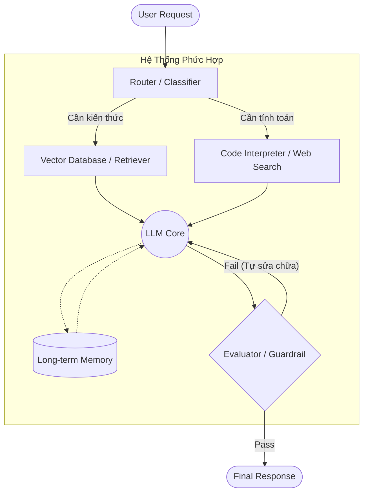

Hãy nhớ lại lần đầu tiên bạn sử dụng ChatGPT. Bạn gõ một câu hỏi khó, và nó trả lời mượt mà, trôi chảy. Bạn nghĩ: *"Wow, AI đã giải quyết được mọi thứ, chỉ cần một cái Prompt thật xịn là xong!"*

Nhưng khi bạn bắt đầu xây dựng các ứng dụng thực tế cho công ty: bạn muốn AI đọc file PDF 10,000 trang, bạn muốn nó tự động viết code rồi chạy thử, hoặc bạn muốn nó đặt vé máy bay... Mọi thứ bắt đầu sụp đổ. Mô hình (Model) bắt đầu "bịa" ra thông tin (Hallucination), quên trước quên sau, hoặc đơn giản là bị giới hạn bởi lượng ngữ cảnh (Context Window).

Chào mừng bạn đến với thực tại của năm 2026. Kỷ nguyên của những mô hình đơn lẻ (Monolithic Models) đã qua. Đây là thời đại của **Compound AI Systems** (Hệ Thống AI Phức Hợp) và **Autonomous Agents** (Đại Lý Tự Trị).

Series bài viết này được "tinh chiết" từ giáo trình **CS 329Z: Engineering AI Agents** (Đại học Stanford), nhằm cung cấp cho bạn một lộ trình thực chiến từ Zero đến Master trong việc thiết kế kiến trúc Agent.

---

## 🧩 1. Monolithic vs. Compound AI Systems

Đừng nhầm lẫn giữa một "Mô hình" (Model) và một "Hệ thống" (System).

- **Monolithic Model (Mô hình đơn lẻ):** Chỉ có một luồng duy nhất: `User Prompt` $\rightarrow$ `LLM` $\rightarrow$ `Response`. Mọi tri thức và logic đều nằm trong các trọng số (weights) của mạng nơ-ron. Bạn không thể "cập nhật" kiến thức mới nếu không fine-tune (huấn luyện lại).
- **Compound AI System (Hệ thống phức hợp):** LLM giờ đây chỉ đóng vai trò là "Bộ não" (Reasoning Engine) bên trong một cỗ máy lớn. Cỗ máy này bao gồm nhiều thành phần tương tác với nhau: LLM, Retrievers (Trình truy xuất), Tools (Công cụ), Memory (Ký ức), và Evaluators (Trình đánh giá).

<Callout type="info" title="Khi nào Compound Systems chiến thắng?">
Compound Systems luôn chiến thắng khi bài toán yêu cầu: (1) Kiến thức thời gian thực (Real-time data), (2) Tương tác với môi trường (như chạy code, gọi API), (3) Xác minh tính đúng đắn chặt chẽ.
</Callout>

Dưới đây là một sơ đồ minh họa kiến trúc Compound AI điển hình:

---

## 🚧 2. Ba Thách Thức Kỹ Nghệ Của AI Agents

Theo giáo trình CS329Z, việc chuyển từ "Viết prompt" sang "Xây dựng hệ thống Agent" đòi hỏi bạn phải giải quyết 3 thách thức lớn (Engineering Challenges):

### Thách thức 1: Phân Rã (Decomposition)
Làm sao để chia một yêu cầu phức tạp (VD: "Viết cho tôi một con web clone Spotify") thành các bước nhỏ để các Agent khác nhau xử lý?
*👉 Chúng ta sẽ học cách giải quyết bằng các Agent Patterns (ReAct, Plan-and-Execute) và Multi-Agent Frameworks.*

### Thách thức 2: Dữ Liệu (Data)
AI Agents "đói" dữ liệu. Không chỉ là dữ liệu để huấn luyện, mà là dữ liệu **Trace (Dấu vết)**. Khi Agent thất bại, làm sao chúng ta lưu lại log để tối ưu hóa nó? 
*👉 Giải pháp nằm ở Data Flywheels và Tự động tối ưu Prompt (DSPy).*

### Thách thức 3: Đánh Giá (Evaluation)
Đây là phần khó nhất. Làm sao bạn biết Agent A tốt hơn Agent B? Nếu nó trả lời đúng ý này nhưng lại gọi sai hàm (Function Calling)?
*👉 Giải pháp: Sử dụng LLM-as-a-Judge và thiết kế bộ Benchmark chuẩn (4-Tuple framework).*

---

## 🚀 3. Chặng Đường Phía Trước

Khóa học này không phải là một "cưỡi ngựa xem hoa". Xuyên suốt 8 bài viết tới, chúng ta sẽ bắt tay vào code thật:
- **Part 2 & 3:** Xây dựng hệ thống RAG nâng cao (ColBERT) và trang bị "Vũ khí" cho Agent bằng chuẩn MCP mới nhất.
- **Part 4 & 5:** Thiết kế cấu trúc Multi-Agent bằng DSPy và quản lý Ký ức bằng MemGPT.
- **Part 6, 7, 8:** Đánh giá, bảo mật và làm chủ các Coding Agent hàng đầu thế giới.

Hẹn gặp lại các bạn ở **[Part 2]**, nơi chúng ta sẽ nhúng tay vào xây dựng "Não Bộ" của Agent với kỹ thuật Structured I/O và RAG nâng cao! 💻
