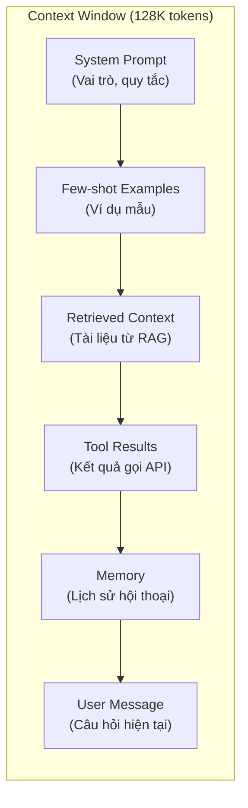
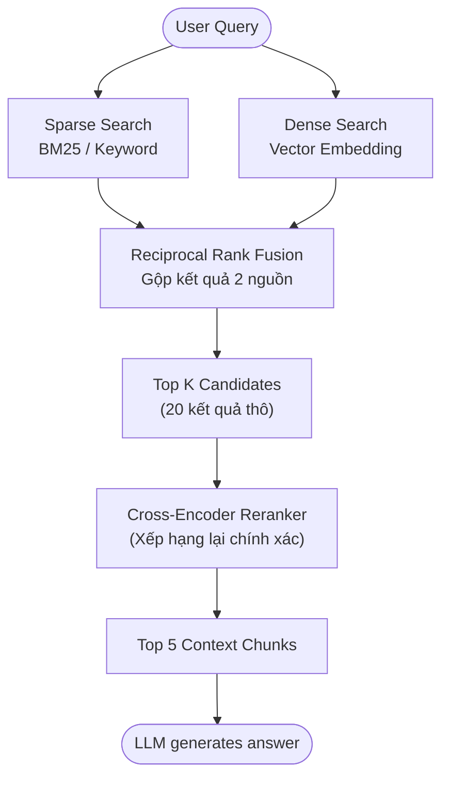

Ở Part 1, chúng ta đã biết rằng LLM chỉ là "Bộ não" bên trong một hệ thống phức hợp lớn hơn. Nhưng bộ não này có một vấn đề nghiêm trọng: nó **"ảo tưởng"** (Hallucinate).

Bạn hỏi: *"Doanh thu Q3 của công ty mình là bao nhiêu?"*. LLM tự tin trả lời: *"Doanh thu Q3 là 12.5 tỷ đồng."* — Một con số hoàn toàn bịa đặt. Vì sao? Vì nó không có quyền truy cập vào dữ liệu nội bộ của bạn.

Trong Part 2, chúng ta sẽ giải quyết triệt để 2 vấn đề nền tảng: **Làm sao để LLM trả ra dữ liệu đúng định dạng?** (Structured I/O) và **Làm sao để "nạp" cho nó đúng kiến thức?** (Context Engineering & RAG).

---

## 🧱 1. Structured I/O: Ép LLM "Nói Đúng Ngữ Pháp"

Khi bạn gọi GPT-4 hoặc Claude và hỏi: *"Phân tích sentiment của câu này"*, nó có thể trả về:
- `"Đây là câu tích cực"` (text tự do)
- `{"sentiment": "positive", "score": 0.92}` (JSON có cấu trúc)

Trong một hệ thống Agent, bạn cần **kiểu trả về thứ hai** 100% thời gian. Vì sao? Vì output của LLM này là input của bước tiếp theo (một hàm, một API, hoặc một Agent khác). Nếu nó trả về text tự do, hệ thống sẽ sập.

### Cách ép Structured Output trong thực tế

Hiện nay, hầu hết các LLM Provider đã hỗ trợ **Structured Output** (hay còn gọi là JSON Mode / Response Format):

```python
from openai import OpenAI
from pydantic import BaseModel

client = OpenAI()

# Định nghĩa kiểu dữ liệu đầu ra bằng Pydantic
class SentimentResult(BaseModel):
    sentiment: str  # "positive", "negative", "neutral"
    confidence: float
    reasoning: str

response = client.responses.parse(
    model="gpt-4.1",
    input=[
        {"role": "system", "content": "Phân tích sentiment."},
        {"role": "user", "content": "Sản phẩm này tệ quá!"}
    ],
    text_format=SentimentResult,
)

result = response.output_parsed
print(result.sentiment)    # "negative"
print(result.confidence)   # 0.95
```

<Callout type="tip" title="Constrained Decoding vs. Prompt-based">
Có 2 cách ép kiểu: (1) **Prompt-based** — chèn "Respond in JSON" vào prompt (không đáng tin cậy). (2) **Constrained Decoding** — LLM Provider ép quá trình sinh token tuân theo JSON Schema (đáng tin cậy 100%). Hãy luôn dùng cách thứ 2 khi Provider hỗ trợ.
</Callout>

---

## 🧠 2. Context Engineering: Nạp Đúng Thứ, Đúng Lúc

Thuật ngữ **"Context Engineering"** (Kỹ nghệ Ngữ cảnh) được Anthropic đưa ra năm 2025, thay thế cho khái niệm cũ "Prompt Engineering". Tại sao?

Vì khi xây dựng Agent, bạn không chỉ viết Prompt nữa. Bạn phải thiết kế toàn bộ **cửa sổ ngữ cảnh** (Context Window) — quyết định thông tin nào được đưa vào, thứ tự ra sao, và loại bỏ gì khi hết chỗ.

### Các thành phần của Context Window



Một kỹ sư Agent giỏi phải biết ưu tiên: Khi Context Window sắp đầy (128K tokens), nên cắt bớt Memory cũ hay giảm số tài liệu RAG? Đây chính là nghệ thuật **Context Engineering**.

### 5 Nguyên tắc vàng (Từ Anthropic)

1. **Cung cấp đủ ngữ cảnh:** Không bao giờ giả định LLM "biết" điều gì đó. Nếu cần dữ liệu công ty, hãy nạp nó vào Context.
2. **Ngữ cảnh phải có cấu trúc:** Dùng XML tags (`<context>...</context>`) hoặc Markdown headers để phân tách rõ ràng.
3. **Đặt System Prompt lên đầu:** LLM có xu hướng ưu tiên thông tin ở đầu Context Window.
4. **Quản lý lịch sử hội thoại:** Tóm tắt (Summarize) các lượt hội thoại cũ thay vì giữ nguyên toàn bộ.
5. **Prefill Response:** Chèn sẵn phần đầu của câu trả lời để LLM "bắt nhịp" đúng hướng.

---

## 🔍 3. RAG Nâng Cao: Vượt Qua Giới Hạn Tìm Kiếm Vector

RAG (Retrieval-Augmented Generation) là kỹ thuật "Nạp kiến thức bên ngoài vào LLM trước khi nó trả lời". Ở mức cơ bản, RAG đơn giản là:
1. Chia tài liệu thành các đoạn nhỏ (Chunks).
2. Chuyển mỗi đoạn thành vector số (Embedding).
3. Khi có câu hỏi, tìm các vector giống nhất (Cosine Similarity).
4. Ghép các đoạn tìm được vào Context Window và gửi cho LLM.

Nhưng cách này có nhiều "Gót chân Achilles":

<Callout type="warning" title="3 Điểm yếu chết người của RAG cơ bản">
1. **Keyword Mismatch:** Người dùng hỏi "cách nấu phở" nhưng tài liệu viết "công thức chế biến phở Bắc" — Embedding đôi khi bỏ sót vì cách diễn đạt khác nhau.
2. **Chunk quá lớn hoặc quá nhỏ:** Chunk lớn thì chứa nhiều noise, chunk nhỏ thì mất ngữ cảnh.
3. **Thiếu thông tin xếp hạng chính xác:** Cosine Similarity là một phép đo "thô", không hiểu ngữ nghĩa sâu.
</Callout>

### Giải pháp: Hybrid Search + Cross-Encoder

Để khắc phục, kiến trúc RAG hiện đại thường kết hợp **Hybrid Search** (Tìm kiếm lai):



- **Sparse Search (BM25):** Tìm kiếm dựa trên từ khóa chính xác. Giải quyết vấn đề Keyword Mismatch.
- **Dense Search (Embedding):** Tìm kiếm dựa trên ngữ nghĩa (Semantic). Hiểu được "nấu phở" ≈ "chế biến phở".
- **Cross-Encoder Reranker:** Sau khi có 20 kết quả thô, cho LLM nhỏ (Cross-Encoder) đọc lại từng cặp (Query, Document) và xếp hạng chính xác hơn. Đây là bước quyết định chất lượng.

### Late Interaction: ColBERT — Tương Lai Của Retrieval

**ColBERT** (Contextualized Late Interaction over BERT) là một kiến trúc retrieval đang được Stanford đánh giá rất cao. Thay vì nén cả câu vào 1 vector duy nhất (như Embedding truyền thống), ColBERT:
1. Tạo vector riêng cho **từng token** trong Query và Document.
2. Khi so sánh, tính điểm tương tác **từng cặp token** (MaxSim).

```python
# Ý tưởng đơn giản hóa của ColBERT
# Thay vì: similarity(query_vec, doc_vec) -> 1 số
# ColBERT:
for q_token in query_tokens:
    max_score = max(
        cosine(q_token, d_token) for d_token in doc_tokens
    )
    total_score += max_score
# -> Hiểu được từng token trong query "khớp" với phần nào của document
```

<Callout type="info" title="Tại sao ColBERT đặc biệt?">
ColBERT giữ được tốc độ của Dense Retrieval (pre-compute document vectors offline) nhưng đạt độ chính xác gần bằng Cross-Encoder. Nó là sự cân bằng hoàn hảo giữa **tốc độ** và **độ chính xác** — đặc biệt quan trọng khi bạn có hàng triệu tài liệu.
</Callout>

---

## 🎯 4. Tổng Kết & Chặng Đường Tiếp Theo

Trong Part 2, chúng ta đã trang bị cho Agent hai năng lực nền tảng:
- **Structured I/O:** Đảm bảo Agent "nói" đúng ngữ pháp mà hệ thống yêu cầu.
- **Context Engineering + RAG:** Đảm bảo Agent "biết" đúng thông tin trước khi hành động.

Nhưng một bộ não thông minh mà không có "Đôi tay" thì chỉ là lý thuyết suông. Trong **[Part 3]**, chúng ta sẽ trang bị cho Agent khả năng **tương tác với thế giới bên ngoài**: gọi API, chạy code, đọc/ghi file thông qua cơ chế **Tool Use (Function Calling)** và giao thức chuẩn mới nhất — **Model Context Protocol (MCP)**. 

Hẹn gặp lại! 🔧
