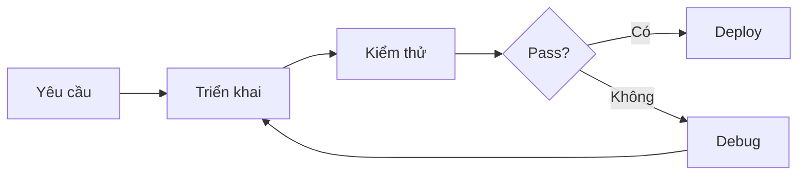
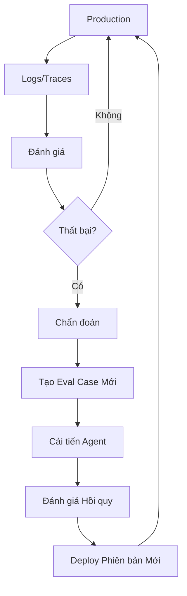
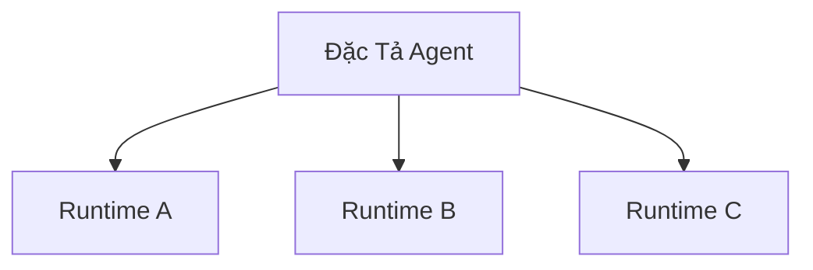
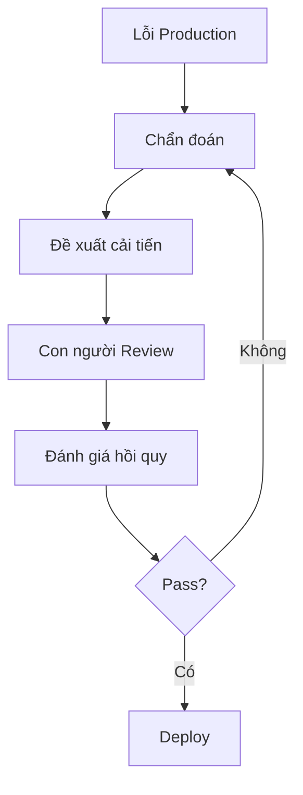

> **Mục tiêu không phải là xây dựng một Agent không bao giờ thất bại. Mục tiêu là xây dựng một hệ thống kỹ nghệ (engineering system) có khả năng học hỏi từ mỗi lần thất bại.**

AI Agents rất dễ để demo.

Chỉ cần cung cấp cho một LLM một tập hợp các công cụ (tools), một system prompt và một tác vụ (task). Agent có thể suy luận, gọi API, kiểm tra file, thực thi lệnh, và cuối cùng đưa ra kết quả.

Bản demo hoạt động hoàn hảo.

Nhưng môi trường thực tế (production) lại là một câu chuyện hoàn toàn khác.

Một Agent hoạt động tốt trong môi trường demo có kiểm soát có thể hành xử khó lường khi phải đối mặt với hàng ngàn tác vụ thực tế kéo dài trong nhiều tuần hoặc nhiều tháng. Nó có thể chọn sai công cụ, hiểu lầm ngữ cảnh, bị kẹt trong một vòng lặp (loop), thực hiện các thay đổi không cần thiết, hoặc tự tin tuyên bố thành công mà không thực sự hoàn thành tác vụ.

Điều này dẫn đến một câu hỏi kỹ thuật mang tính nền tảng:

**Làm thế nào để chúng ta cải tiến liên tục một AI Agent sau khi nó đã được triển khai?**

Câu trả lời không đơn giản chỉ là "sửa lỗi" (fix bugs).

Chúng ta cần một vòng lặp cải tiến hoàn toàn mới.

---

## 1. Tại Sao Vòng Lặp Phát Triển Phần Mềm Truyền Thống Là Không Đủ?

Kỹ thuật phần mềm truyền thống thường tuân theo một vòng lặp tất định (deterministic loop):



Khi có lỗi xảy ra, các kỹ sư thường có một lộ trình tương đối rõ ràng:

1. Tái tạo lại lỗi (Reproduce).
2. Kiểm tra log và stack trace.
3. Xác định đoạn code gây lỗi.
4. Áp dụng bản vá (Fix).
5. Chạy lại kiểm thử hồi quy (Regression test).
6. Triển khai (Deploy).

AI Agents lại mang đến một lớp các vấn đề hoàn toàn khác.

Một Agent có thể thực thi một quỹ đạo (trajectory) như sau:

```text
Yêu cầu người dùng
    ↓
Hiểu tác vụ
    ↓
Lên kế hoạch (Plan)
    ↓
Chọn công cụ (Tool)
    ↓
Gọi công cụ
    ↓
Quan sát kết quả
    ↓
Cập nhật kế hoạch
    ↓
Chọn công cụ khác
    ↓
...
    ↓
Kết quả cuối cùng
```

Thất bại cuối cùng có thể không đến từ một lỗi phần mềm truyền thống.

Vấn đề cốt lõi có thể là:

* Suy luận sai lệch (incorrect reasoning)
* Phân rã tác vụ kém (poor task decomposition)
* Thiếu ngữ cảnh (insufficient context)
* Chọn sai công cụ (incorrect tool selection)
* Truyền sai tham số vào công cụ (bad tool arguments)
* Không có khả năng phục hồi sau lỗi (failure to recover)
* Hoàn thành quá sớm (premature completion)
* Thông tin "ảo giác" (hallucinated information)
* Thực thi kém hiệu quả (inefficient execution)
* Tiêu tốn quá nhiều token (excessive token consumption)

Sự khác biệt quan trọng nằm ở đây:

> **Một ứng dụng truyền thống thường thất bại vì code hoạt động không đúng. Một AI Agent có thể thất bại vì hành vi (behavior) của nó không chính xác.**

Điều này làm cho quá trình debug trở nên khó khăn hơn gấp nhiều lần.

---

## 2. Quỹ Đạo Của Agent (Trajectory) Là Rất Quan Trọng

Hãy thử xem xét một coding agent được yêu cầu sửa một unit test đang bị lỗi.

Kết quả cuối cùng là:

```text
❌ Tests vẫn lỗi
```

Một hệ thống debug truyền thống có thể sẽ cho chúng ta biết rằng lệnh chạy test trả về một exit code khác 0.

Nhưng câu hỏi thú vị hơn là:

**Tại sao Agent lại thất bại?**

Giả sử quỹ đạo (trajectory) của nó là:

```text
Bước 1  ✓ Hiểu yêu cầu
Bước 2  ✓ Xác định test bị lỗi
Bước 3  ✓ Đọc source code
Bước 4  ❌ Hiểu sai thông báo lỗi (error message)
Bước 5  ❌ Sửa đổi một component không liên quan
Bước 6  ❌ Chạy sai test suite
Bước 7  ❌ Tuyên bố hoàn thành tác vụ
```

Bây giờ chúng ta đã có thông tin hữu ích hơn rất nhiều.

Thất bại không chỉ đơn giản là:

> "Code không chạy được."

Mà là:

> "Agent đã hiểu sai lỗi ở Bước 4 và sau đó đưa ra hàng loạt quyết định dựa trên sự suy diễn sai lệch đó."

Đây là lý do tại sao khả năng quan sát của Agent (**agent observability**) trở thành một năng lực kỹ thuật hàng đầu.

Chúng ta cần phải ghi lại được quỹ đạo của Agent:

```text
Đầu vào (Input)
↓
Kế hoạch (Plan)
↓
Các lệnh gọi Model
↓
Các lệnh gọi Tool
↓
Tham số truyền vào Tool
↓
Kết quả của Tool
↓
Lỗi (Errors)
↓
Các quyết định trung gian
↓
Đầu ra cuối cùng (Final output)
```

Nếu không có những thông tin này, việc cải thiện một Agent phần lớn chỉ là phỏng đoán.

---

## 3. Từ Fix Bug Chuyển Sang Cải Thiện Hành Vi (Behavior)

Điều này thay đổi tư duy kỹ thuật.

Thay vì hỏi:

> "Bug đang nằm ở đâu?"

chúng ta nên hỏi:

> "Hành vi nào đã dẫn đến kết quả này?"

Và thay vì mô hình:

```text
Thất bại → Vá lỗi (Patch)
```

chúng ta muốn:

```text
Thất bại
   ↓
Quan sát (Observe)
   ↓
Đánh giá (Evaluate)
   ↓
Chẩn đoán (Diagnose)
   ↓
Xác định mẫu (Identify pattern)
   ↓
Cải tiến (Improve)
   ↓
Kiểm thử hồi quy (Regression test)
```

Mục tiêu không còn là sửa một lỗi riêng lẻ nữa.

Mục tiêu là ngăn chặn **toàn bộ nhóm lỗi tương tự (class of failures)** tái diễn.

---

## 4. Hai Vòng Lặp Của Một Hệ Thống Agentic

Một mô hình tư duy (mental model) hữu ích là hãy nghĩ về hai vòng lặp kết nối với nhau:

### Vòng lặp cải tiến Offline (Offline Improvement Loop)

Đây là vòng lặp phát triển (development loop).

```mermaid
flowchart LR
    A[Đặc tả/Yêu cầu] --> B[Triển khai]
    B --> C[Đánh giá (Evaluation)]
    C --> D{Đạt chuẩn?}
    D -->|Chưa| E[Cải tiến]
    E --> B
    D -->|Rồi| F[Deploy]
```

Chúng ta định nghĩa trách nhiệm của Agent, triển khai nó, đánh giá, cải tiến, và lặp lại cho đến khi nó đạt được ngưỡng chất lượng yêu cầu.

Nhưng đây mới chỉ là một nửa câu chuyện.

Một khi Agent được đưa ra production, người dùng thực tế sẽ tạo ra những tình huống mới không hề có trong tập dữ liệu đánh giá ban đầu.

Điều đó tạo ra vòng lặp thứ hai.

---

### Vòng lặp cải tiến Online (Online Improvement Loop)



Đây là bước chuyển đổi mang tính quyết định:

> **Các thất bại trên production phải trở thành các test case đánh giá (evaluations) trong tương lai.**

Môi trường production sẽ đóng vai trò là một nguồn tri thức mới, nuôi dưỡng quá trình phát triển.

---

## 5. Thất Bại Trên Production Phải Trở Thành Evaluation Cases

Hãy tưởng tượng một Agent ban đầu có 100 bài đánh giá (evaluation cases).

```text
Bộ Đánh Giá (Evaluation Suite)
├── Case 1
├── Case 2
├── ...
└── Case 100
```

Sau khi deploy, quá trình chạy trên production phát hiện ra 3 mẫu lỗi mới:

```text
Lỗi A
Lỗi B
Lỗi C
```

Một quy trình cải tiến yếu kém có thể chỉ đơn giản là vá những vấn đề nhỏ lẻ này.

Một quy trình mạnh mẽ hơn sẽ làm thế này:

```text
Bộ đánh giá hiện tại
        +
Lỗi production A
        +
Lỗi production B
        +
Lỗi production C
        ↓
Bộ đánh giá mới
```

Bộ đánh giá giờ đây có 103 test case.

Và theo thời gian:

```text
100
 ↓
103
 ↓
127
 ↓
184
 ↓
251
 ↓
...
```

Bộ đánh giá dần trở thành một thứ gì đó quan trọng hơn là chỉ một tập hợp các bài test.

Nó trở thành **bộ nhớ tổ chức (institutional memory)** của Agent.

Mỗi thất bại quan trọng đều dạy cho hệ thống rằng:

> "Đây là điều mà mày không được phép làm sai một lần nào nữa."

---

## 6. Đánh Giá (Evaluation) Cần Phải Đưa Ra Hành Động Được (Actionable)

Chỉ một con số điểm là không đủ.

Thử hình dung:

```text
Điểm số của Agent = 72%
```

Điều này cho chúng ta biết rằng Agent đang có vấn đề.

Nhưng nó không cho chúng ta biết cần phải cải thiện cái gì.

Một hệ thống đánh giá hữu ích cần phải giúp trả lời:

```text
Điều gì đã thất bại?
        ↓
Tại sao nó thất bại?
        ↓
Cần thay đổi điều gì?
        ↓
Làm thế nào để xác minh sự thay đổi đó?
```

Ví dụ:

```text
Tác vụ (Task):
Tạo câu truy vấn database

Kết quả:
JOIN sai bảng

Nhóm lỗi:
Lỗi ngữ cảnh (Context failure)

Nguyên nhân cốt lõi (Root cause):
Agent đã không trích xuất thông tin schema liên quan

Hướng cải tiến:
Cải thiện việc truy xuất schema database

Test case hồi quy (Regression case):
Bổ sung tình huống cross-tenant JOIN
```

Điều này biến quá trình đánh giá (evaluation) từ một "bảng điểm" vô tri thành một công cụ kỹ thuật thực thụ.

Mục tiêu của evaluation không đơn thuần là:

> **Đo lường chất lượng.**

Mà nó là:

> **Tạo ra các thông tin có khả năng cải thiện chất lượng.**

---

## 7. Đánh Giá Nhiều Hơn Là Kết Quả Cuối Cùng

Đối với một lời gọi LLM đơn giản, việc đánh giá câu trả lời cuối cùng có thể là đủ.

Nhưng đối với một Agent, điều đó thường là chưa đủ.

Một hệ thống đánh giá hiệu quả có thể cần xem xét các khía cạnh sau:

| Khía cạnh (Dimension) | Câu hỏi |
| ----------------- | ------------------------------------------- |
| Tính chính xác (Correctness) | Kết quả cuối cùng có đúng không? |
| Độ thành công (Task Success) | Agent có thực sự hoàn thành mục tiêu không? |
| Quỹ đạo (Trajectory) | Agent có tuân theo một lộ trình hợp lý không? |
| Sử dụng công cụ (Tool Usage) | Nó có chọn và sử dụng đúng công cụ không? |
| Độ tin cậy (Reliability) | Hành vi của nó có nhất quán qua nhiều lần chạy không? |
| Tính hiệu quả (Efficiency) | Nó có sử dụng quá nhiều token/bước không cần thiết không? |
| Độ trễ (Latency) | Quá trình thực thi mất bao lâu? |
| Độ an toàn (Safety) | Agent có tôn trọng các ranh giới và quy tắc không? |

Ví dụ, hai Agent có thể đều giải quyết thành công một tác vụ:

```text
Agent A
20 bước
25k tokens
120 giây

Agent B
7 bước
8k tokens
25 giây
```

Nếu chúng ta chỉ đo lường "tính chính xác" (correctness):

```text
Agent A = Pass
Agent B = Pass
```

Chúng ta đã bỏ lỡ một sự khác biệt to lớn về mặt kỹ thuật.

Trên môi trường production, **chi phí và độ trễ cũng là một phần tạo nên chất lượng của Agent**.

---

## 8. Chẩn Đoán Lỗi Theo Các Mẫu Khái Quát (Pattern)

Giả sử chúng ta thu thập được 1.000 lượt chạy bị thất bại.

Rất dễ để bị cuốn vào việc điều tra từng lỗi một.

Nhưng cách làm đó không thể mở rộng (scale) được.

Thay vào đó, hãy phân nhóm (cluster) chúng.

```text
1.000 lỗi
       ↓
   Phân nhóm (Clustering)
       ↓
 ┌─────┼──────────┐
 ↓     ↓          ↓
Ngữ cảnh Công cụ Kế hoạch (Planning)
 320   270        410
```

Sau đó, tiến hành điều tra từng nhóm:

```text
Lỗi lên kế hoạch (Planning failures)
       ↓
 ┌─────┼───────────┐
 ↓     ↓           ↓
Chia nhỏ tác vụ  Xác thực      Hoàn thành quá sớm
```

Giờ đây, đội ngũ kỹ thuật không còn phải đi fix 410 lỗi riêng lẻ nữa.

Họ đang giải quyết một số lượng nhỏ các vấn đề mang tính hệ thống.

Đây là một trong những sự chuyển dịch quan trọng nhất:

> **Chuyển từ việc debug từng-lỗi-một sang phân tích lỗi-theo-mẫu (failure-pattern analysis).**

---

## 9. Các Lỗi Thường Gặp Có Thể Trở Thành Các Bước Kiểm Tra Giá Rẻ

Có một sự tối ưu hóa cực kỳ mạnh mẽ khác.

Đó là không phải bài kiểm tra (evaluation) nào cũng cần sử dụng LLM.

Giả sử hệ thống đánh giá liên tục phát hiện ra:

```text
Agent thường xuyên chỉnh sửa các file nằm ngoài
phạm vi được yêu cầu.
```

Ban đầu, một LLM Evaluator có thể giúp xác định hành vi này.

Nhưng một khi chúng ta đã nắm bắt được quy luật (pattern), chúng ta có thể tạo ra một hàm kiểm tra tất định (deterministic check):

```text
Các file đã bị thay đổi
       ↓
Chúng có nằm trong phạm vi cho phép không?
       ↓
   ┌───┴───┐
   ↓       ↓
  CÓ     KHÔNG
   ↓       ↓
Tiếp tục  FAIL
```

LLM đã làm rất tốt nhiệm vụ **khám phá ra pattern**.

Quy tắc tất định (code logic thông thường) lại cực kỳ hiệu quả trong việc **thực thi pattern đó với chi phí rẻ mạt**.

Điều này gợi ý một chiến lược tối ưu hóa thú vị:

> **Sử dụng các hệ thống thông minh (và đắt tiền) để khám phá ra các pattern lỗi lặp đi lặp lại, sau đó chuyển đổi các pattern đó thành những bài kiểm tra rẻ tiền hơn (code logic truyền thống) bất cứ khi nào có thể.**

Theo thời gian, bản thân hệ thống đánh giá cũng sẽ trở nên hiệu quả và tiết kiệm chi phí hơn.

---

## 10. Tách Biệt Đặc Tả Agent Khỏi Môi Trường Chạy (Runtime)

Một nguyên lý kiến trúc quan trọng khác là sự phân tách giữa **những gì một Agent nên làm** với **cách thức nó được triển khai**.

Một đặc tả của Agent (Agent specification) có thể mô tả:

```text
Trách nhiệm
Ngữ cảnh (Context)
Công cụ (Tools)
Giới hạn (Constraints)
Tiêu chí thành công
```

Môi trường chạy (Runtime) có thể là:

```text
Framework A
Framework B
Hệ thống orchestration tùy chỉnh
Các loại LLM khác nhau
Hệ thống Tool khác nhau
```

Mối quan hệ giữa chúng nên giống như thế này:



Thay vì:

```text
Đặc tả (Specification)
      ↓
Triển khai gắn chặt với một Framework cụ thể
      ↓
Mọi thứ bị dính chặt vào nhau (Coupled)
```

Điều này rất quan trọng vì hệ sinh thái Agent đang thay đổi với một tốc độ chóng mặt.

Các Model liên tục thay đổi.

Framework thay đổi.

Hệ thống tooling thay đổi.

Các pattern điều phối thay đổi.

Một đặc tả (specification) ổn định sẽ mang lại cho chúng ta một nền tảng vững chắc để vượt qua những sự thay đổi liên tục đó.

---

## 11. Human-in-the-Loop Vẫn Vô Cùng Cần Thiết

Cải tiến liên tục (Continuous improvement) không có nghĩa là:

```text
AI gặp lỗi
 ↓
AI tự sửa chính nó
 ↓
AI tự deploy chính nó
```

Điều đó cực kỳ nguy hiểm.

Một kiến trúc an toàn hơn là:



Agent có thể tự động hóa việc điều tra lỗi và đưa ra các đề xuất cải thiện.

Con người sẽ review lại những giả định quan trọng, những bằng chứng và các thay đổi có sức ảnh hưởng lớn.

Mục tiêu không phải là loại bỏ con người hoàn toàn.

Mục tiêu là làm cho sự tham gia của con người trở nên **có sức bật lớn hơn (higher leverage)**.

Thay vì phải dùng sức người dò dẫm kiểm tra hàng ngàn dòng log/trace, một kỹ sư bây giờ sẽ review:

```text
Mẫu lỗi (Failure pattern)
Nguyên nhân cốt lõi (Root cause)
Bằng chứng
Sự thay đổi được đề xuất
Kết quả test hồi quy
```

Đây là một quy trình kỹ thuật có khả năng scale tốt hơn rất nhiều.

---

## 12. Kiến Trúc Tham Khảo (A Reference Architecture)

Lắp ghép mọi thứ lại với nhau:

```mermaid
flowchart TD
    A[Đặc Tả Agent] --> B[Triển Khai Agent]
    B --> C[Đánh Giá Offline]
    C --> D{Pass?}
    D -->|Không| E[Cải tiến]
    E --> B
    D -->|Có| F[Production]
    F --> G[Quan Sát / Traces]
    G --> H[Đánh Giá]
    H --> I{Thất bại?}
    I -->|Không| F
    I -->|Có| J[Chẩn Đoán Lỗi]
    J --> K[Phân Nhóm Lỗi (Clustering)]
    K --> L[Phân Tích Nguyên Nhân]
    L --> M[Tạo Test Case Mới]
    M --> N[Đề Xuất Cải Tiến]
    N --> O[Con Người Review]
    O --> P[Đánh Giá Hồi Quy]
    P --> Q{Pass?}
    Q -->|Không| L
    Q -->|Có| F
```

Kiến trúc này tạo ra một vòng lặp phản hồi (feedback loop):

```text
Xây dựng (Build)
 ↓
Đánh giá (Evaluate)
 ↓
Deploy
 ↓
Quan sát (Observe)
 ↓
Chẩn đoán (Diagnose)
 ↓
Học hỏi (Learn)
 ↓
Cải thiện (Improve)
 ↓
Đánh giá (Evaluate)
 ↓
Deploy
 ↺
```

Đó chính là **Vòng Lặp Cải Tiến Agent (Agentic Improvement Loop)**.

---

## 13. Ví Dụ: Trợ Lý Lập Trình (Coding Agent)

Hãy thử áp dụng mô hình này vào một coding agent thực tế.

Giả sử tác vụ được giao là:

> "Hãy fix lỗi các bài test Angular Karma đang bị fail."

Agent có thể sẽ hành động như sau:

```text
1. Đọc các bài test đang fail
2. Tìm kiếm component liên quan
3. Đọc các dependency
4. Sửa source code
5. Chạy test
6. Phân tích lỗi
7. Tiếp tục sửa code
8. Chạy lại test
9. Kết thúc
```

Hệ thống sẽ tiến hành ghi lại (record):

```text
Tác vụ
Trạng thái của repository
Quỹ đạo của Agent
Các lệnh gọi tool
Các command đã chạy
Đầu ra của quá trình test
Các file đã bị thay đổi
Số lượng token đã dùng
Độ trễ
Kết quả cuối cùng
```

Hệ thống Evaluator sẽ kiểm tra:

```text
✓ Các test mục tiêu đã pass chưa
✓ Toàn bộ test suite hồi quy có pass không
✓ TypeScript compile thành công không
✓ Có thay đổi các file không liên quan không
✓ Có thêm các dependency không cần thiết không
✓ Đã thỏa mãn toàn bộ yêu cầu của tác vụ chưa
✓ Số lần lặp (iterations) có hợp lý không
```

Giả sử trên production phát sinh tình huống sau:

```text
Lỗi:
Agent sửa thành công test mục tiêu nhưng lại làm hỏng một test khác.
```

Chúng ta không chỉ đơn giản là nhắc nhở Agent một câu:

> "Đừng có làm vỡ test nhé."

Chúng ta phải tạo ra một tình huống đánh giá (evaluation case) cụ thể:

```text
Case #108:
Fix bài test đang lỗi trong khi vẫn giữ nguyên
hành vi hiện có của các component liên quan.
```

Bây giờ, phiên bản Agent tiếp theo bắt buộc phải pass được kịch bản này.

Nếu loại lỗi này xảy ra quá thường xuyên, chúng ta có thể đưa thêm một quy tắc cứng (deterministic rule) vào hệ thống:

```text
Trước khi hoàn thành tác vụ:
Bắt buộc phải chạy các test mục tiêu
+
Chạy toàn bộ các test hồi quy bị ảnh hưởng
```

Agent lúc này đã được cải thiện chất lượng bởi vì **kinh nghiệm trên production đã được chuyển đổi thành tri thức kỹ thuật vững chắc**.

---

## 14. Bức Tranh Lớn (The Bigger Picture)

Sự thay đổi lớn nhất không nằm ở việc áp dụng một framework mới hay viết một câu prompt hay hơn.

Nó nằm ở việc thay đổi tư duy kỹ nghệ về AI Agent (AI Agent engineering).

Lối tư duy cũ là:

```text
Xây dựng Agent
    ↓
Làm cho nó chạy được
    ↓
Deploy
```

Lối tư duy mới là:

```text
Xây dựng Agent
    ↓
Đo lường hành vi (Measure behavior)
    ↓
Deploy
    ↓
Quan sát quá trình sử dụng thực tế
    ↓
Học hỏi từ những thất bại
    ↓
Cải tiến
    ↓
Thêm các bài test hồi quy
    ↓
Deploy lại
    ↺
```

Bản thân Agent chỉ là một component đơn lẻ.

Chính **hệ thống cải tiến liên tục bao quanh Agent** mới là thứ giúp nó đạt chuẩn production.

---

## Kết Luận

Việc xây dựng một AI Agent chỉ chạy đúng một lần là tương đối dễ dàng.

Nhưng việc xây dựng một AI Agent luôn duy trì được độ tin cậy khi số lượng người dùng, tác vụ, bộ công cụ và các tình huống edge-cases (biên) ngày càng tăng lên, lại là một bài toán kỹ thuật khó hơn rất nhiều.

Kỹ thuật phần mềm truyền thống mang lại cho chúng ta những khái niệm đầy sức mạnh như kiểm thử (testing), tính quan sát được (observability), gỡ lỗi (debugging) và kiểm thử hồi quy (regression testing). Nhưng các hệ thống agentic (hướng tác nhân) đòi hỏi chúng ta phải mở rộng những ý tưởng này sang **hành vi (behavior), quỹ đạo (trajectories), đánh giá (evaluation), chẩn đoán (diagnosis) và phản hồi liên tục (continuous feedback)**.

Nguyên tắc quan trọng nhất cực kỳ đơn giản:

> **Mọi thất bại quan trọng trên production đều phải có một con đường để quay trở lại quy trình phát triển.**

Một hệ thống agentic trưởng thành do đó sẽ ít giống kiểu:

```text
Prompt → LLM → Tools → Answer
```

mà sẽ giống thế này hơn:

```text
Đặc tả (Specification)
      ↓
Triển khai (Implementation)
      ↓
Đánh giá (Evaluation)
      ↓
Deployment
      ↓
Production
      ↓
Khả năng quan sát (Observability)
      ↓
Chẩn đoán (Diagnosis)
      ↓
Test Cases Đánh giá Mới (New Evaluation Cases)
      ↓
Cải tiến (Improvement)
      ↓
Kiểm thử hồi quy (Regression Testing)
      ↺
```

Mục tiêu không phải là xây dựng một Agent không bao giờ thất bại.

**Mục tiêu là xây dựng một hệ thống kỹ thuật ngày càng trở nên tốt hơn sau mỗi lần Agent thất bại.**
