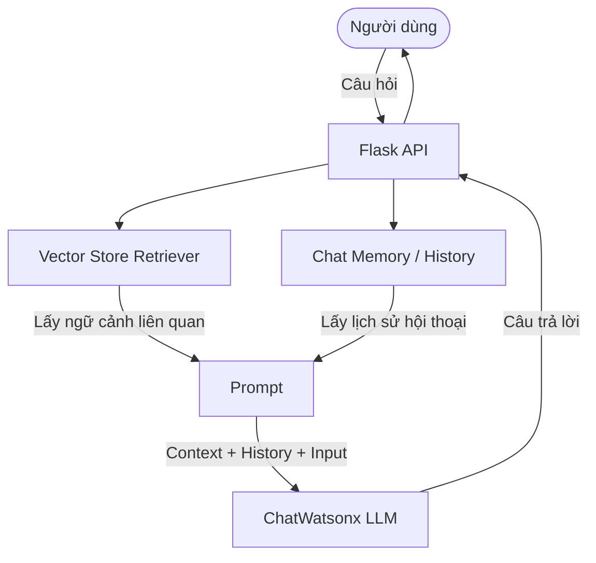

Chào mừng các bạn quay lại với series **LangChain Thực Chiến**! Ở Phần 1, chúng ta đã cùng tìm hiểu những khái niệm cơ bản như LLM, tokenization, cách gọi model từ `ibm-watsonx-ai` với LangChain và bọc tất cả lại trong một ứng dụng web Flask kết hợp `JsonOutputParser`. 

Hôm nay, trong Phần 2, chúng ta sẽ "nâng cấp" ứng dụng này bằng hai kỹ thuật vô cùng quan trọng khi xây dựng GenAI App thực tế: **RAG (Retrieval-Augmented Generation)** và **Chat Memory**.

---

## Điều kiện tiên quyết

Trước khi bắt đầu Phần 2, hãy đảm bảo bạn đã:
- Đọc và thực hành xong Phần 1 để hiểu cấu trúc cơ bản của ứng dụng.
- Cài đặt môi trường, có API key và tài khoản IBM Watsonx.

---

## 1. RAG (Retrieval-Augmented Generation) là gì?

LLM rất thông minh, nhưng chúng có một điểm yếu chung: **chỉ biết những gì được huấn luyện**. Nếu bạn hỏi LLM về một tài liệu nội bộ của công ty hoặc một sự kiện mới diễn ra hôm qua, nó sẽ bó tay hoặc bịa ra câu trả lời (hallucination).

**RAG** ra đời để giải quyết triệt để vấn đề này. RAG cho phép chúng ta "cung cấp thêm tài liệu" cho LLM tham khảo trước khi trả lời câu hỏi. Quy trình của RAG bao gồm các bước sau:

1. **Document Loaders**: Đọc tài liệu (PDF, Text, HTML,...).
2. **Text Splitters**: Chia tài liệu lớn thành các đoạn nhỏ (chunks) để giữ nguyên ý nghĩa mà không vượt quá giới hạn context window của LLM.
3. **Embeddings & Vector Store**: Biến các đoạn text thành vector (số hóa) và lưu trữ vào Vector Database.
4. **Retrieval**: Khi người dùng đặt câu hỏi, hệ thống sẽ tìm các chunks có nội dung liên quan nhất để đưa cho LLM làm ngữ cảnh.

### Kiến trúc hệ thống tổng quan

Dưới đây là sơ đồ minh họa luồng hoạt động khi kết hợp RAG và Chat Memory:



### Cài đặt thư viện cần thiết

Trước tiên, bạn cần cài đặt thêm một số thư viện để xử lý file PDF, tạo Embeddings và dùng Vector DB (chúng ta sẽ sử dụng ChromaDB).

```bash
pip install chromadb pypdf sentence-transformers langchain-huggingface
```

### Triển khai RAG với LangChain

Dưới đây là một đoạn code ví dụ về cách nạp một file PDF, chia nhỏ văn bản và lưu vào Chroma:

```python
from langchain_community.document_loaders import PyPDFLoader
from langchain_text_splitters import RecursiveCharacterTextSplitter
from langchain_community.vectorstores import Chroma
from langchain_huggingface import HuggingFaceEmbeddings

# 1. Đọc file PDF
loader = PyPDFLoader("data/sample.pdf")
docs = loader.load()

# 2. Chia nhỏ tài liệu
text_splitter = RecursiveCharacterTextSplitter(
    chunk_size=1000, # 1000 ký tự (characters)
    chunk_overlap=200
)
splits = text_splitter.split_documents(docs)

# 3. Tạo Embeddings và lưu vào Vector Store
embeddings = HuggingFaceEmbeddings(model_name="all-MiniLM-L6-v2")
vectorstore = Chroma.from_documents(documents=splits, embedding=embeddings)

# 4. Tạo Retriever để query
retriever = vectorstore.as_retriever(search_kwargs={"k": 3})
```

---

## 2. Chat Memory: Để Chatbot có "Trí Nhớ"

Nếu không có Memory, mỗi API request bạn gửi cho chatbot sẽ được coi là một cuộc hội thoại hoàn toàn mới. Ứng dụng sẽ không biết bạn đã nói gì ở câu trước đó. 

Để chatbot nhớ được ngữ cảnh hội thoại trong LangChain, chúng ta có thể sử dụng `RunnableWithMessageHistory` kết hợp với class lưu trữ.

```python
from langchain_core.chat_history import BaseChatMessageHistory
from langchain_community.chat_message_histories import ChatMessageHistory

# Dictionary lưu trữ session chat
store = {}

def get_session_history(session_id: str) -> BaseChatMessageHistory:
    if session_id not in store:
        store[session_id] = ChatMessageHistory()
    return store[session_id]
```

> [!NOTE]
> Việc sử dụng Dictionary `store = {}` để lưu trữ lịch sử hội thoại ở đây chỉ mang tính chất minh họa và học tập. Trong môi trường thực tế (production), bạn cần sử dụng các cơ sở dữ liệu chuyên dụng như Redis hoặc MongoDB để duy trì Memory lâu dài và có thể mở rộng.

---

## 3. Tích hợp vào Flask App

Bây giờ, hãy ghép tất cả những mảnh ghép lại (ChatWatsonx từ Phần 1, RAG và Memory) vào trong ứng dụng Flask của chúng ta.

```python
from flask import Flask, request, jsonify
from langchain_ibm import ChatWatsonx
from langchain_core.prompts import ChatPromptTemplate, MessagesPlaceholder
from langchain_core.runnables.history import RunnableWithMessageHistory
from langchain.chains.combine_documents import create_stuff_documents_chain
from langchain.chains import create_retrieval_chain
from dotenv import load_dotenv
import os

# Import các thành phần từ file setup_rag.py
from setup_rag import retriever, get_session_history

load_dotenv()

app = Flask(__name__)

# 1. Khởi tạo ChatWatsonx
watsonx_llm = ChatWatsonx(
    model_id="meta-llama/llama-3-70b-instruct",
    url=os.getenv("WATSONX_URL"),
    project_id=os.getenv("WATSONX_PROJECT_ID"),
    params={
        "max_new_tokens": 512,
        "temperature": 0.5
    }
)

# 2. Tạo Prompt kết hợp System Message, Context (từ RAG), và History
prompt = ChatPromptTemplate.from_messages([
    ("system", "Bạn là một trợ lý ảo hữu ích. Hãy trả lời câu hỏi dựa trên tài liệu sau: \n\n{context}"),
    MessagesPlaceholder(variable_name="chat_history"),
    ("human", "{input}")
])

# 3. Tạo Chain kết hợp RAG
question_answer_chain = create_stuff_documents_chain(watsonx_llm, prompt)
rag_chain = create_retrieval_chain(retriever, question_answer_chain)

# 4. Bọc Chain với Message History
conversational_rag_chain = RunnableWithMessageHistory(
    rag_chain,
    get_session_history,
    input_messages_key="input",
    history_messages_key="chat_history",
    output_messages_key="answer",
)

@app.route('/api/chat', methods=['POST'])
def chat():
    data = request.json
    user_message = data.get('message')
    session_id = data.get('session_id', 'default_session') # Nhận diện user thông qua session_id
    
    if not user_message:
        return jsonify({"error": "Message is required"}), 400
        
    try:
        # Gọi chain và truyền session_id
        response = conversational_rag_chain.invoke(
            {"input": user_message},
            config={"configurable": {"session_id": session_id}}
        )
        
        return jsonify({
            "answer": response["answer"],
            "session_id": session_id
        })
    except Exception as e:
        return jsonify({"error": str(e)}), 500

if __name__ == '__main__':
    app.run(port=5000, debug=True)
```

### Test thử API

Bạn có thể dùng Postman hoặc `cURL` để test thử khả năng ghi nhớ và đọc tài liệu của ứng dụng:

```bash
# Câu hỏi 1: Yêu cầu lấy thông tin từ tài liệu PDF (RAG)
curl -X POST http://localhost:5000/api/chat \
-H "Content-Type: application/json" \
-d '{"message": "Trong tài liệu dự án có nói gì về quy trình release?", "session_id": "user123"}'

# Câu hỏi 2: Test trí nhớ (Memory)
curl -X POST http://localhost:5000/api/chat \
-H "Content-Type: application/json" \
-d '{"message": "Vậy bước tiếp theo của quy trình đó là gì?", "session_id": "user123"}'

# Câu hỏi 3: Thử nghiệm với một session_id mới hoàn toàn
curl -X POST http://localhost:5000/api/chat \
-H "Content-Type: application/json" \
-d '{"message": "Vậy bước tiếp theo của quy trình đó là gì?", "session_id": "user999"}'
```

Ở **Câu hỏi 3**, vì bạn đang sử dụng một `session_id` hoàn toàn mới (`user999`), hệ thống sẽ không có lịch sử trò chuyện của `user123`. Chatbot sẽ không hiểu "quy trình đó" là gì, qua đó minh chứng rõ ràng sự khác biệt của ngữ cảnh và hiệu quả của Memory.

Với cấu hình trên, mỗi `session_id` sẽ sở hữu một ngữ cảnh hội thoại riêng biệt, kết hợp với sức mạnh từ tài liệu nội bộ đã được "RAG hóa".

---

## Tổng kết

Trong Phần 2 này, chúng ta đã thành công nâng cấp GenAI App của mình:
- Cấp "sách giáo khoa" cho LLM bằng cách nạp tài liệu và chunking lưu vào Vector Database (**RAG**).
- Cấp "trí nhớ" cho ứng dụng bằng **Chat Memory**, giúp chatbot nhớ được ngữ cảnh trò chuyện.

Kết hợp với Flask và sức mạnh từ model trên IBM Watsonx từ Phần 1, bạn đã có một bộ khung vững chắc để xây dựng các trợ lý ảo doanh nghiệp có khả năng giải đáp thông tin nội bộ. Hẹn gặp lại các bạn trong những phần tiếp theo của series LangChain Thực Chiến!
