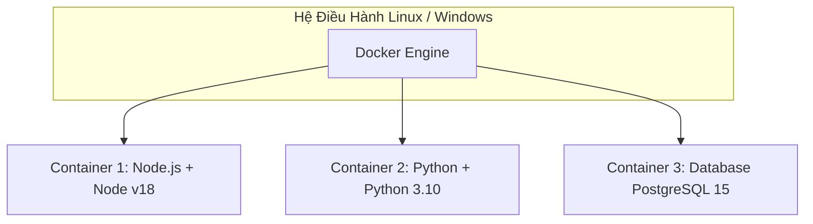

Hãy tưởng tượng bạn vừa code xong một tính năng tuyệt đỉnh bằng Node.js. Ứng dụng chạy mượt mà trên máy Mac của bạn. Bạn hào hứng nén code gửi cho team Tester (QA) hoặc deploy lên server Linux của công ty.

Vài phút sau, Slack nổ thông báo:
*"Em ơi, máy chị báo lỗi thiếu package `node-gyp`"*
*"Anh ơi, server báo lỗi phiên bản Node.js không tương thích!"*

Và bạn buông ra câu nói kinh điển nhất mọi thời đại của giới lập trình viên: **"Ủa lạ vậy, trên máy em chạy bình thường mà (It works on my machine)!"**. 

Đây chính là nỗi đau ngàn năm của quá trình phát triển phần mềm: Bất đồng bộ môi trường. Giải pháp là gì? Hãy nhét toàn bộ "cái máy của bạn" vào một chiếc hộp, và gửi chiếc hộp đó đi. Đó chính là **Docker**.

---

## 🐳 1. Docker Dưới Góc Nhìn Đơn Giản Nhất

Đừng vội đi vào mớ lý thuyết về Kernel, Namespaces hay Cgroups. Hãy nhìn vào kiến trúc thực tế:



*Một server duy nhất có thể chạy song song nhiều Container mà không xảy ra xung đột (Conflict) phiên bản.*

- **Image (Bản thiết kế):** Một file tĩnh, chứa Code của bạn + Môi trường (Node.js/Java) + Thư viện (node_modules/pom.xml). Nó giống như bản vẽ thiết kế của một ngôi nhà.
- **Container (Ngôi nhà thực tế):** Khi bạn "chạy" cái Image đó lên, nó trở thành một Container. Bạn có thể xây 10 ngôi nhà giống hệt nhau từ 1 bản thiết kế.

---

## 🛠️ 2. Viết Dockerfile Cho Ứng Dụng Node.js (Cách Cũ - Không Khuyến Khích)

Giả sử bạn có một ứng dụng Express.js. Dưới đây là cách mà 90% Lập trình viên mới học Docker thường viết `Dockerfile`:

```dockerfile
# 1. Chọn môi trường gốc
FROM node:18-alpine

# 2. Đặt thư mục làm việc bên trong Container
WORKDIR /app

# 3. Copy toàn bộ code từ máy thật vào Container
COPY . .

# 4. Cài đặt thư viện
RUN npm install

# 5. Khai báo cổng
EXPOSE 3000

# 6. Chạy app
CMD ["npm", "start"]
```

<Callout type="warning" title="Tại sao cách này tệ?">
Cách viết này sẽ copy cả thư mục `node_modules` (nếu có) từ máy thật vào container, dễ gây phình to Image hoặc lỗi môi trường. Hơn nữa, nó cài cả thư viện Dev (`devDependencies`) vào môi trường Production!
</Callout>

---

## 🚀 3. Multi-stage Build: Nghệ Thuật Của Các Kỹ Sư Senior

Để tạo ra một Docker Image siêu nhẹ và cực kỳ bảo mật cho Production, chúng ta áp dụng **Multi-stage Build**. Ý tưởng là: Dùng một container để "Build" code (cần nhiều tool nặng), sau đó lấy cái "thành phẩm" (nhẹ tênh) bỏ sang một container trống khác để chạy.

```dockerfile
# --- STAGE 1: Build Stage (Thợ xây) ---
FROM node:18-alpine AS builder

WORKDIR /app
# Chỉ copy package.json trước để tận dụng Docker Cache
COPY package*.json ./
RUN npm ci

# Copy toàn bộ source code và build
COPY . .
RUN npm run build


# --- STAGE 2: Production Stage (Ngôi nhà hoàn thiện) ---
FROM node:18-alpine AS runner

WORKDIR /app
# Cấu hình môi trường Production
ENV NODE_ENV production

# Chỉ cài đặt thư viện cần thiết cho Production (bỏ qua devDependencies)
COPY package*.json ./
RUN npm ci --only=production

# LẤY "thành phẩm" từ thợ xây (builder stage) sang
COPY --from=builder /app/dist ./dist

# Quyền bảo mật: Không chạy bằng quyền root
USER node

EXPOSE 3000
CMD ["node", "dist/index.js"]
```

### Lợi ích tuyệt đối của Multi-stage:
1. **Kích thước siêu nhỏ:** Image giảm từ 800MB xuống còn 80MB. Push/Pull cực nhanh, tiết kiệm tiền lưu trữ AWS ECR.
2. **Bảo mật cao:** Không chứa mã nguồn gốc (`.ts`), không chứa các tool build, và chạy dưới quyền user `node` thay vì `root`.

---

## 🎯 4. Tổng Kết & Chặng Đường Tiếp Theo

Bằng việc tạo ra Docker Image bằng Multi-stage, ứng dụng của bạn giờ đây đã có thể chạy trên BẤT KỲ máy chủ nào có cài đặt Docker (AWS EC2, Google Cloud Compute, hay máy tính cá nhân) mà không sợ lỗi môi trường.

Tuy nhiên, nếu hệ thống của bạn có tới 10 microservices (Backend, Frontend, Redis, Database, Message Queue), bạn không thể gõ tay `docker run` 10 lần được! 

Trong **[Part 2]**, chúng ta sẽ tìm hiểu công cụ **Docker Compose** để "Dàn nhạc hóa" toàn bộ hệ thống này chỉ với 1 thao tác bấm. Hãy đón xem nhé! 🚀
