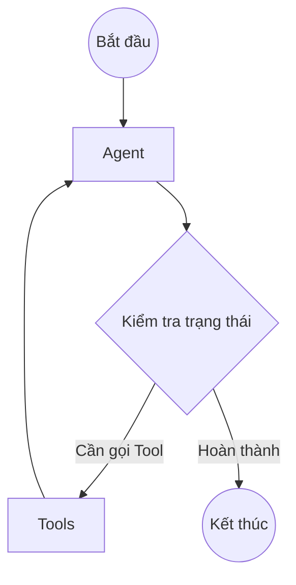

# Open Source Deep Dive Tập 1: Giải mã kiến trúc đằng sau LangGraph

Trong thế giới phát triển AI Agents đang bùng nổ, **LangGraph** (được phát triển bởi đội ngũ đứng sau LangChain) đã nổi lên như một trong những framework mã nguồn mở sáng giá nhất. Không chỉ dừng lại ở các pipeline tuyến tính (như DAGs - Directed Acyclic Graphs) thông thường, LangGraph mang đến một luồng sinh khí mới cho việc xây dựng các agent phức tạp, có khả năng suy nghĩ vòng lặp và tự hiệu chỉnh.

Nhưng điều gì làm nên sức mạnh của LangGraph dưới góc độ kỹ thuật? Trong tập đầu tiên của series **Open Source Deep Dive**, chúng ta sẽ cùng "mổ xẻ" kiến trúc mã nguồn mở đằng sau LangGraph và xem các Software Engineers có thể học được những pattern nào từ dự án đang rất thịnh hành này.

## 1. State Machine, Cyclic Graphs và Thuật toán Pregel

Điểm khác biệt cốt lõi nhất của LangGraph so với các framework khác chính là khả năng xử lý **Cyclic Graphs** (Đồ thị có chu trình) dựa trên nền tảng của thuật toán **Pregel**.

Khi xây dựng một AI Agent thông minh, luồng tư duy của nó hiếm khi là một đường thẳng đi từ A đến B. Áp dụng pattern phổ biến như ReAct, Agent thường cần đi qua một vòng lặp: Đưa ra quyết định -> Gọi công cụ (Tool) -> Đánh giá kết quả -> Lặp lại cho đến khi hoàn thành.

Dưới đây là sơ đồ minh họa cho vòng lặp tư duy này:



Để thực thi đồ thị trên một cách hiệu quả, LangGraph được truyền cảm hứng từ mô hình **Pregel API của Google**. Việc thực thi được chia thành các **Supersteps** (siêu bước). Trong mỗi superstep:
- Các Node đang ở trạng thái active sẽ đọc dữ liệu đầu vào.
- Thực thi logic nghiệp vụ (gọi LLM, chạy code, v.v.).
- Gửi dữ liệu đầu ra để tiếp tục kích hoạt các Node tiếp theo ở superstep sau.

### Quản lý Trạng thái (State) với Reducers và Channels

Dữ liệu luân chuyển giữa các node không được truyền trực tiếp, mà thông qua cơ chế **Channels** mang phong cách **Pub/Sub** (Publish/Subscribe). Các node sẽ "publish" bản cập nhật (update) của mình vào các channel, và LangGraph framework sẽ chịu trách nhiệm tổng hợp lại thành một `State` duy nhất.

Đặc biệt, LangGraph không đơn thuần ghi đè (overwrite) state mới lên state cũ. Framework sử dụng khái niệm **Reducers** — các hàm cho phép định nghĩa cách cập nhật trạng thái, điển hình là cộng dồn (accumulate). 

Ví dụ dưới đây minh họa cách định nghĩa `State` bằng `TypedDict` và sử dụng hàm reducer `operator.add` để nối thêm các tin nhắn mới vào danh sách hội thoại thay vì xóa mất tin nhắn cũ:

```python
import operator
from typing import TypedDict, Annotated
from langgraph.graph import StateGraph, START, END

# Định nghĩa State Schema
class AgentState(TypedDict):
    # Sử dụng reducer `operator.add` giúp cộng dồn (append) message mới 
    # vào danh sách thay vì ghi đè toàn bộ list
    messages: Annotated[list, operator.add]
    context: str

# Khởi tạo đồ thị
workflow = StateGraph(AgentState)

# workflow.add_node("agent", agent_node)
# workflow.add_node("tools", tool_node)
# ...
```

## 2. Checkpointing & Fault Tolerance: "Time Travel" và Human-in-the-loop

Trong một hệ thống agent chạy ngầm hoặc chạy trong thời gian dài, làm sao để đảm bảo an toàn nếu có lỗi xảy ra? Hoặc làm sao để con người có thể can thiệp vào giữa quá trình? LangGraph giải quyết bài toán này thông qua cơ chế **Checkpointing**.

Bằng cách liên tục ghi lại toàn bộ `State` sau mỗi lần thực thi một Node vào bộ nhớ, LangGraph mang đến những khả năng cực kỳ mạnh mẽ:
- **Fault Tolerance (Khả năng chịu lỗi):** Nếu một node bị crash, framework có thể dễ dàng khôi phục lại trạng thái ngay trước đó và tiếp tục chạy.
- **"Time Travel" (Du hành thời gian):** Trạng thái được lưu lại cho phép developer "tua lại" (rewind) một bước trước đó, chỉnh sửa input hoặc state, và chạy lại luồng (fork).
- **Human-in-the-loop (Con người tham gia vào luồng):** Agent có thể tự động tạm dừng (pause) tại các checkpoint nhất định để chờ người dùng duyệt (approve) trước khi thực thi các hành động nhạy cảm.

LangGraph cung cấp sẵn các class Checkpointer mạnh mẽ phục vụ cho từ môi trường dev cho đến production, bao gồm: `MemorySaver` (lưu in-memory), `SqliteSaver` (lưu file local), và `AsyncPostgresSaver` (dùng cho production quy mô lớn).

Đoạn code sau minh họa cách tích hợp `MemorySaver` khi biên dịch (compile) đồ thị:

```python
from langgraph.checkpoint.memory import MemorySaver

# Khởi tạo checkpointer để lưu trữ state
memory_saver = MemorySaver()

# Compile graph, truyền checkpointer vào để bật tính năng lưu trạng thái
app = workflow.compile(checkpointer=memory_saver)

# Lúc này bạn có thể sử dụng thread_id để gọi lại các phiên làm việc (sessions) cũ
```

## 3. Actor Model và Multi-agent Orchestration

Khi bài toán mở rộng từ một agent đơn lẻ thành nhiều agents phối hợp với nhau (Multi-agent), sự phức tạp trong giao tiếp và chia sẻ trạng thái tăng lên theo cấp số nhân. Mặc dù không thuần túy là một framework Actor Model, LangGraph đã học hỏi rất nhiều từ pattern này để quản lý orchestration.

Mỗi Agent hoặc Sub-graph có thể được xem như một "Actor" độc lập. Nó nhận thông điệp (input state) thông qua Channels, xử lý công việc chuyên môn của mình, và trả về thông điệp (output state) cho hệ thống điều phối chung. Việc đóng gói (encapsulation) trạng thái nội bộ của từng tác nhân giúp hệ thống trở nên:
- **Dễ mở rộng (Scalable):** Bạn có thể dễ dàng cắm thêm các agent mới (như Researcher Agent, Reviewer Agent) vào luồng.
- **Tách biệt trách nhiệm (Separation of Concerns):** Mỗi agent tập trung vào một task cụ thể mà không làm ảnh hưởng đến global state nếu không cần thiết.

## Kết luận: Bài học cho Software Engineers

Đọc mã nguồn của LangGraph không chỉ là học về AI, mà còn là một kho tàng về Software Engineering. Dưới đây là những bài học đắt giá bạn có thể bỏ túi:

1. **Thiết kế hệ thống xoay quanh State (State-driven design):** Đừng truyền dữ liệu lung tung. Hãy định nghĩa một schema rõ ràng cho State (như TypedDict hay Pydantic) và biến nó thành nguồn chân lý (Single Source of Truth) duy nhất qua từng node.
2. **Immutability và Checkpointing:** Việc lưu trữ các bản snapshot của state (thay vì ghi đè liên tục) mở ra hàng loạt cơ chế mạnh mẽ cho debugging, phục hồi lỗi và quản lý version trạng thái.
3. **Mô hình hóa bài toán bằng Graph & Kiến trúc hướng sự kiện (Event-driven Architecture):** Khi các câu lệnh `if/else` trở nên mất kiểm soát, State Machine và Graph là cứu cánh để trực quan hóa luồng logic. Việc kết hợp với cơ chế Pub/Sub và Channels biến hệ thống thành một kiến trúc Event-driven thực thụ, nơi các module (hay các Node/Agent) giao tiếp lỏng lẻo (loosely coupled) nhưng lại mang tới hiệu suất và sự linh hoạt tối đa.

LangGraph thực sự là một case study mẫu mực về cách xây dựng framework cho thế hệ phần mềm tương lai. Hẹn gặp lại các bạn trong Tập 2 của series **Open Source Deep Dive**!
