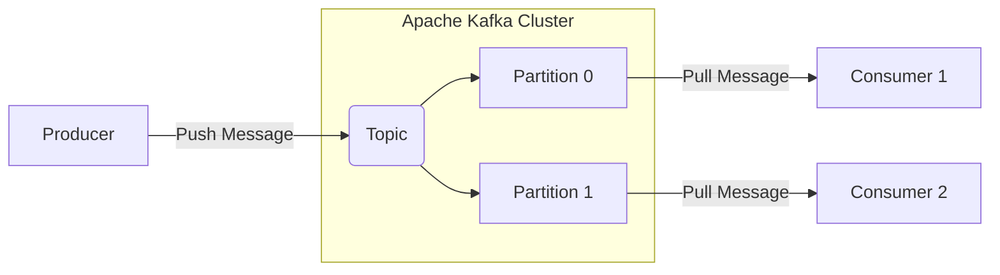
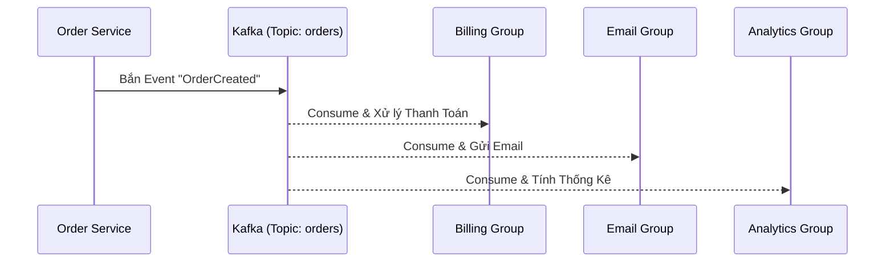
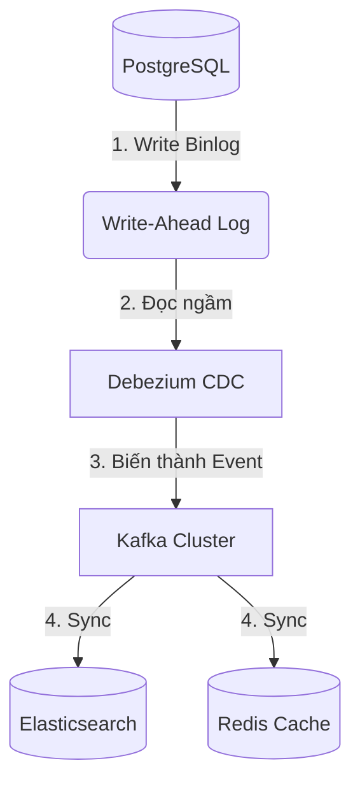
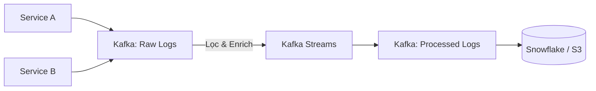

Ngày Black Friday năm ngoái, hệ thống e-commerce của chúng tôi chính thức sập nguồn ngay ở phút thứ 15 của chiến dịch.

Lượng người dùng ập vào gấp 100 lần bình thường. Các service thay nhau gửi hàng chục ngàn message "Tạo Đơn Hàng" vào RabbitMQ. Memory của RabbitMQ phình to mất kiểm soát vì Consumer (Service Thanh Toán, Service Gửi Email) chết ngắc ngoải, không xử lý kịp lượng tin nhắn khổng lồ. Và bùm! Hàng đợi vỡ trận, 20.000 đơn hàng mất tích vào cõi hư vô. CTO xanh mặt, điện thoại réo liên tục, còn anh em dev thì nhìn màn hình đỏ lòm trong bất lực.

Đó là lúc chúng tôi nhận ra: **RabbitMQ không sinh ra để chịu tải Big Data**. Chúng tôi cần một giải pháp không bao giờ mất dữ liệu, có thể nuốt trọn hàng triệu event mỗi giây mà không chớp mắt. 

Và chúng tôi tìm đến **Apache Kafka**.

---

## 🐣 Phần 1: Xóa Mù Từ Vựng (Tại sao Kafka không phải là Message Queue?)

Nếu bạn mang tư duy Message Queue truyền thống để áp dụng vào Kafka, kiến trúc hệ thống của bạn sẽ lại vỡ nát. Bản chất thực sự của Kafka là một **Distributed Commit Log** (Nhật ký gắn nối phân tán).

Hãy cùng "nhìn" vào cách hoạt động của nó:

*Trong kiến trúc trên, Kafka đóng vai trò trung tâm hút toàn bộ dữ liệu. Topic được băm nhỏ thành các Partitions để chia đều công việc.*

### Bốn Trụ Cột Bạn Phải Nắm Rõ:
1. **Topic & Partition**: Thay vì dùng "Queue", Kafka ném tin nhắn vào "Topic". Để giải quyết bài toán scale, một Topic bị băm nhỏ thành hàng tá **Partition** nằm rải rác ở nhiều server.
2. **Offset (Tọa độ đọc)**: Khác biệt sinh tử! Khi Consumer đọc xong, Kafka **KHÔNG XÓA MESSAGE**. Nó chỉ cấp cho message đó một số thứ tự tăng dần gọi là `Offset`. Server sập? Không sao, khởi động lại và đọc tiếp từ Offset cũ.
3. **Producer & Consumer**: Kẻ bơm dữ liệu (Producer) và kẻ hút dữ liệu (Consumer).
4. **Consumer Group**: Nhiều Consumer gom lại thành một nhóm. **Một Partition chỉ được đọc bởi MỘT Consumer duy nhất trong cùng một Group**. 

---

## 🚀 Phần 2: TOP KAFKA USE CASES BẰNG HÌNH ẢNH

Dưới đây là cách Kafka hóa giải những bài toán khó nhằn nhất trong môi trường Microservices.

### 1. Pub-Sub Fan-Out (Quạt Gió Đa Luồng)
Trong hệ thống cũ, Order Service phải gọi REST API đồng bộ (chờ đợi) đến 3 service khác. Rất dễ sập dây chuyền. Hãy nhìn cách Kafka giải quyết:

*Một sự kiện duy nhất được quạt ra (Fan-out) cho 3 nhóm Consumer khác nhau. Mỗi nhóm có tốc độ xử lý riêng (Offset riêng) mà không ai giẫm chân lên ai.*

### 2. Change Data Capture (Bắt Mạch Database)
Làm sao để đồng bộ dữ liệu từ PostgreSQL sang Elasticsearch (để Search) hoặc Redis (để Cache) theo thời gian thực mà không làm nghẽn Database?

*Thay vì chèn hàng chục dòng code bất đồng bộ vào API, công cụ CDC (Debezium) sẽ theo dõi sự thay đổi vật lý của Database (Binlog/WAL) và đẩy lên Kafka.*

### 3. Log Aggregation & Stream Processing
Thay vì SSH vào từng server để đọc Log, các Service A, B, C xả toàn bộ Log Stream vào Kafka. Từ đó, các công cụ xử lý dòng (Flink, Kafka Streams) sẽ lọc dữ liệu "on-the-fly" trước khi ném vào Data Warehouse.

*Dữ liệu thô bay vào, được bộ não Kafka Streams cắt gọt, làm giàu (Enrich), rồi đổ vào kho lạnh cực kỳ mượt mà.*

### 4. Replay & Recovery (Cỗ Máy Thời Gian)
Vào một ngày đẹp trời, Consumer xử lý điểm thưởng của bạn bị dính một con Bug to đùng và tính sai 5.000 user. Nếu dùng Message Queue thông thường (tin nhắn đã bị xóa), bạn đã chính thức làm mất dữ liệu!

Với Kafka (vì tin nhắn được lưu trữ trên ổ đĩa 7 ngày), bạn chỉ cần fix bug, **Tua ngược (Rewind) Offset** về quá khứ 2 ngày trước, và chạy lại code. Khép lại một thảm họa!

---

## 🦸 Phần 3: HERO - Rào Cản Lên Cấp Senior

### Lời Nguyền Của Phân Tán: Vấn Đề Ordering (Thứ Tự)
Kafka CHỈ đảm bảo thứ tự của message trong phạm vi **CÙNG MỘT PARTITION**.
Nếu bạn bắn event `[Tạo Đơn] -> [Đóng Gói] -> [Giao Hàng]` vào Topic một cách vô định, rất có thể chúng sẽ rơi vào 3 Partition khác nhau. Kết quả là Consumer có thể nhận lệnh "Giao Hàng" trước cả lệnh "Tạo Đơn"!

<Callout type="warning" title="Khắc phục bằng Partition Key">
Phải băm (Hash) `Order_ID` thành `Partition Key`. Khi đó, mọi event của đơn hàng #1234 luôn bay vào chung một Partition số 3. Mọi thứ tự được đảm bảo 100%.
</Callout>

### Exactly-Once Semantics (Giao hàng chuẩn xác một lần)
Kafka mặc định hỗ trợ At-least-once (Ít nhất một lần - tức là có thể bị trùng message). Tuy nhiên, nếu bạn xây dựng ứng dụng ngân hàng, bạn có thể bật **Exactly-once (EOS)** thông qua cơ chế Transactional API. Đổi lại, bạn phải chịu chi phí hiệu năng (Latency) cao hơn để Kafka tiến hành commit hai pha.

### KRaft - Vĩnh Biệt Cục Nợ ZooKeeper
Từ Kafka 3.3+, ZooKeeper đã chính thức bị "khai tử" và thay thế bằng giao thức đồng thuận **KRaft** (Kafka Raft). Hệ thống giờ đây tự chủ, không còn phụ thuộc service bên ngoài, thời gian khôi phục khi sập node giảm từ vài phút xuống còn mili-giây.

---

## 🎯 Tổng Kết

Apache Kafka không đơn thuần chỉ là một ống nước truyền tin. Trong kỷ nguyên dữ liệu lớn, nó đóng vai trò là "Hệ thần kinh trung ương" (Central Nervous System) của toàn bộ doanh nghiệp.

Tuy nhiên, trước khi vội vã đưa Kafka vào dự án, hãy tự hỏi:
<Callout type="tip" title="Đừng Dùng Dao Mổ Trâu Để Giết Gà">
Việc vận hành một cluster Kafka cần đội ngũ am hiểu sâu về Disk I/O, JVM Tuning, PageCache và Network. Nếu dự án của bạn chỉ cần một hàng đợi xử lý vài nghìn email một ngày, hãy để RabbitMQ hoặc Redis Pub/Sub làm việc của chúng một cách thảnh thơi!
</Callout>
