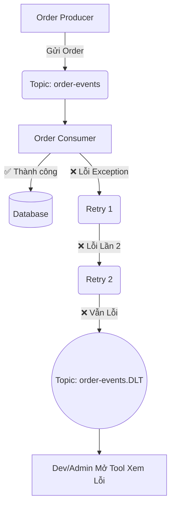

Bạn đã đọc vô số bài viết về lý thuyết Apache Kafka. Bạn biết Kafka là gì, biết Producer, Consumer, và Topic hoạt động ra sao. Thậm chí bạn có thể chém gió về "Distributed Commit Log" một cách trơn tru.

Nhưng khi sếp giao task: *"Tích hợp Kafka vào microservices của công ty để xử lý thanh toán"*, bạn mở IDE lên và... đứng hình.

*Mình phải cài Zookeeper à?*
*Code Producer bằng Spring Boot như thế nào?*
*Nếu Consumer bị lỗi RuntimeException khi đang đọc message thì sao? Message đó có bị mất không? Hay nó sẽ block toàn bộ hệ thống?*

Đó là một cảm giác cực kỳ ức chế. Lý thuyết thì màu hồng, nhưng thực hành thì đầy rẫy hố bom. Trong môi trường Production, nếu bạn không biết cách bắt lỗi (DLQ - Dead Letter Queue), một message bị lỗi data format có thể kẹt mãi mãi và đánh sập cả luồng xử lý đơn hàng của doanh nghiệp.

Đừng lo! Bài viết này chính là **Phần thực chiến** bạn đang tìm kiếm. Chúng ta sẽ cùng nhau setup Kafka đời mới nhất (bỏ Zookeeper), code Spring Boot từ số 0, và áp dụng pattern Enterprise (DLQ) để xử lý lỗi như một Senior Engineer đích thực.

---

## 🐋 1. Setup Kafka Trong 1 Nốt Nhạc (KRaft Mode)

Từ phiên bản 3.3+, Kafka đã chính thức vứt bỏ ZooKeeper cũ kỹ để dùng cơ chế KRaft (Kafka Raft), giúp hệ thống nhẹ và khởi động cực nhanh.

Tạo một file `docker-compose.yml` ở một thư mục bất kỳ:

```yaml
version: '3'
services:
  kafka:
    image: bitnami/kafka:latest
    container_name: kafka-local
    ports:
      - "9092:9092"
    environment:
      - KAFKA_CFG_NODE_ID=1
      - KAFKA_CFG_PROCESS_ROLES=controller,broker
      - KAFKA_CFG_LISTENERS=PLAINTEXT://:9092,CONTROLLER://:9093
      - KAFKA_CFG_LISTENER_SECURITY_PROTOCOL_MAP=CONTROLLER:PLAINTEXT,PLAINTEXT:PLAINTEXT
      - KAFKA_CFG_CONTROLLER_QUORUM_VOTERS=1@kafka:9093
      - KAFKA_CFG_CONTROLLER_LISTENER_NAMES=CONTROLLER
```

Mở Terminal và gõ: `docker-compose up -d`. Boom! Bạn đã có một cụm Kafka chạy ngon lành trên cổng `9092`.

---

## 🚀 2. Code Producer: Gắn Phản Lực Cho Ứng Dụng

Hãy tạo một project Spring Boot (dùng Spring Initializr) và thêm dependency `Spring for Apache Kafka`.

<Callout type="tip" title="Best Practice">
Trong môi trường thực tế, chúng ta hiếm khi gửi plain text. Thay vào đó, hãy gửi một Object (JSON) để dễ dàng thao tác.
</Callout>

### Cấu hình `application.yml`:

```yaml
spring:
  kafka:
    bootstrap-servers: localhost:9092
    producer:
      key-serializer: org.apache.kafka.common.serialization.StringSerializer
      value-serializer: org.springframework.kafka.support.serializer.JsonSerializer
```

### Code Producer Service:

```java
import org.springframework.kafka.core.KafkaTemplate;
import org.springframework.stereotype.Service;
import lombok.RequiredArgsConstructor;
import lombok.extern.slf4j.Slf4j;

@Service
@Slf4j
@RequiredArgsConstructor
public class OrderProducer {

    private final KafkaTemplate<String, OrderEvent> kafkaTemplate;
    private static final String TOPIC = "order-events";

    public void sendOrderEvent(OrderEvent event) {
        log.info("🚀 Đang gửi đơn hàng vào Kafka: {}", event.getOrderId());
        
        // Gửi message với Key là OrderId để đảm bảo Ordering trong Partition
        kafkaTemplate.send(TOPIC, event.getOrderId(), event)
            .whenComplete((result, ex) -> {
                if (ex == null) {
                    log.info("✅ Đã gửi thành công. Offset: {}", result.getRecordMetadata().offset());
                } else {
                    log.error("❌ Gửi thất bại: {}", ex.getMessage());
                }
            });
    }
}
```

---

## 🎧 3. Code Consumer: Hút Dữ Liệu Lên

Việc lắng nghe (consume) dữ liệu trong Spring Boot cực kỳ đơn giản nhờ Annotation `@KafkaListener`. 

### Cấu hình `application.yml` (bổ sung):

```yaml
spring:
  kafka:
    consumer:
      group-id: "order-processing-group"
      auto-offset-reset: earliest
      key-deserializer: org.apache.kafka.common.serialization.StringDeserializer
      value-deserializer: org.springframework.kafka.support.serializer.ErrorHandlingDeserializer
      properties:
        spring.deserializer.value.delegate.class: org.springframework.kafka.support.serializer.JsonDeserializer
        spring.json.trusted.packages: "*"
```

### Code Consumer Service:

```java
import org.springframework.kafka.annotation.KafkaListener;
import org.springframework.stereotype.Service;
import lombok.extern.slf4j.Slf4j;

@Service
@Slf4j
public class OrderConsumer {

    @KafkaListener(topics = "order-events", groupId = "order-processing-group")
    public void consumeOrder(OrderEvent event) {
        log.info("📥 Đã nhận được đơn hàng: {}", event.getOrderId());
        
        // Mô phỏng xử lý logic (Lưu Database, Gọi API thanh toán...)
        processOrder(event);
    }
    
    private void processOrder(OrderEvent event) {
        // ... Business logic ...
    }
}
```

<Callout type="warning" title="Sát Thủ Thầm Lặng: Poison Pill">
Chuyện gì xảy ra nếu field `amount` của `OrderEvent` gửi đến là chữ thay vì số? Deserializer sẽ quăng Exception. Nếu bạn không cài `ErrorHandlingDeserializer` như trong file yml ở trên, Consumer của bạn sẽ rơi vào vòng lặp vô hạn (Infinite Loop), liên tục đọc lại message lỗi đó và đánh sập RAM!
</Callout>

---

## 🛡️ 4. Cấp Độ Enterprise: Dead Letter Queue (DLQ)

Đây là điểm khác biệt giữa dev thường và dev Senior. Khi hệ thống của bạn gặp lỗi logic (ví dụ: Không tìm thấy User trong Database khi xử lý Đơn hàng), bạn KHÔNG THỂ vứt bỏ message đó, nhưng cũng KHÔNG THỂ kẹt lại (block) ở message đó mãi mãi.

**Giải pháp:** Bắt lỗi -> Ném message bị lỗi sang một Topic "Thùng rác" (Dead Letter Queue) -> Tiếp tục xử lý message tiếp theo. Các message trong thùng rác sẽ được DEV kiểm tra lại bằng tay sau.



*Một kiến trúc DLQ tiêu chuẩn: Thử lại (Retry) vài lần trước khi thực sự "bỏ cuộc" và ném vào hố đen.*

### Cấu hình DLQ Bằng Code (Vô cùng thần kỳ với Spring Kafka)

Thực sự Spring Kafka đã làm sẵn mọi thứ. Bạn chỉ cần khai báo một cái `Bean` để nói cho nó biết bạn muốn xử lý lỗi thế nào.

```java
import org.springframework.context.annotation.Bean;
import org.springframework.context.annotation.Configuration;
import org.springframework.kafka.core.KafkaTemplate;
import org.springframework.kafka.listener.DeadLetterPublishingRecoverer;
import org.springframework.kafka.listener.DefaultErrorHandler;
import org.springframework.util.backoff.FixedBackOff;

@Configuration
public class KafkaConfig {

    @Bean
    public DefaultErrorHandler errorHandler(KafkaTemplate<Object, Object> template) {
        // DeadLetterPublishingRecoverer tự động tạo một topic có hậu tố .DLT
        DeadLetterPublishingRecoverer recoverer = new DeadLetterPublishingRecoverer(template);
        
        // FixedBackOff(khoảng cách giữa các lần retry, số lần retry)
        // Dưới đây: Cách nhau 1 giây (1000ms), thử lại tối đa 2 lần. Tổng cộng 3 lần chạy.
        FixedBackOff backOff = new FixedBackOff(1000L, 2);
        
        return new DefaultErrorHandler(recoverer, backOff);
    }
}
```

Bây giờ, hãy thử ném một cái Exception ngớ ngẩn nào đó bên trong hàm `consumeOrder`. Bạn sẽ thấy Log hiển thị quá trình Retry 2 lần. Và sau khi thất bại hoàn toàn, message sẽ lặng lẽ trôi vào Topic `order-events.DLT`. 

Ứng dụng của bạn vẫn sống sót, Consumer vẫn tiếp tục gặm nhấm những đơn hàng tiếp theo. Hoàn hảo!

---

## 🎯 Lời Kết

Bạn vừa tự tay xây dựng một Pipeline Kafka chuẩn chỉ. Từ việc xua đuổi Zookeeper, định nghĩa Producer/Consumer bằng JSON, cho đến việc dựng lá chắn bảo vệ hệ thống với DLQ.

Tất nhiên, Kafka còn vô vàn thứ hay ho (Exactly-Once Semantics, Kafka Streams, Schema Registry). Nhưng với bộ khung này, bạn đã thừa sức "chinh chiến" ở bất kỳ dự án Enterprise nào ngoài kia. 

Đừng đọc xong để đó, mở IntelliJ lên và "gõ" ngay nhé! Chúc bạn không bao giờ làm rớt mất data! 🍻
