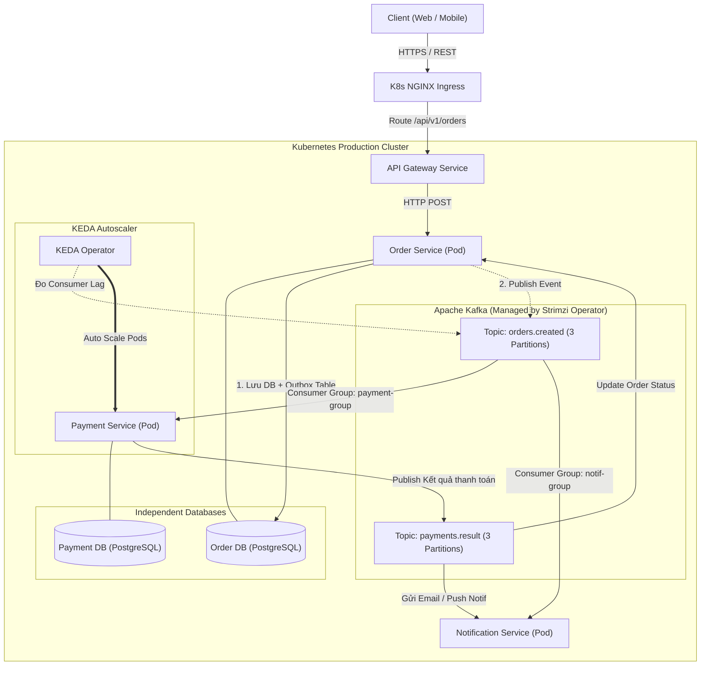

Khi phỏng vấn vị trí Senior Backend hay System Architect, một trong những câu hỏi phổ biến nhất là: *"Làm thế nào để xây dựng một hệ thống Microservices xử lý hàng triệu giao dịch, đảm bảo không mất dữ liệu, và tự động mở rộng theo tải thực tế?"*

Hầu hết lập trình viên đều có thể trả lời các từ khóa quen thuộc: *"Dùng Microservices để chia nhỏ bài toán, dùng Apache Kafka để truyền thông điệp bất đồng bộ, và đóng gói triển khai lên Kubernetes (K8s)"*.

Nhưng từ **lý thuyết** đến **môi trường Production thực tế** là một khoảng cách khổng lồ:
- Viết code service thì chạy tốt, nhưng khi một service chết giữa chừng lúc đang gửi event thì data trong database và Kafka có bị lệch không? (**Bài toán Dual Write**)
- Nếu Kafka gửi lặp message (at-least-once delivery), làm sao đảm bảo tài khoản của người dùng không bị trừ tiền hai lần? (**Bài toán Idempotency**)
- Deploy Kafka lên Kubernetes bằng StatefulSet thông thường hay dùng Operator? Làm sao để cluster tự phục hồi khi Broker gặp sự cố?
- Làm sao K8s biết khi nào một Consumer Service đang bị nghẽn (Lag) để tự động tăng số lượng Pod, thay vì chỉ đo CPU/RAM một cách mù quáng?

Bài viết này là cẩm nang tích hợp trọn vẹn cả 3 mảnh ghép: **Microservices + Kafka + Kubernetes**, đưa bạn từ thiết kế kiến trúc, xử lý lỗi phân tán, cho đến đóng gói và vận hành tự động trên Kubernetes chuẩn doanh nghiệp.

---

## 🏛️ 1. Bức Tranh Kiến Trúc Tổng Thể (System Architecture)

Chúng ta sẽ lấy một bài toán kinh điển trong doanh nghiệp: **Hệ thống Xử lý Đơn hàng & Thanh toán (E-Commerce Order Processing)**.



### Các nguyên tắc nền tảng:
1. **Database per Service**: Mỗi microservice sở hữu toàn quyền một database riêng. Tuyệt đối không để `Payment Service` query trực tiếp vào bảng `orders` của `Order Service`.
2. **Asynchronous Decoupling**: Luồng tạo đơn hàng kết thúc ngay khi order được ghi nhận ở trạng thái `PENDING`. Mọi xử lý tiếp theo (trừ tiền, xuất kho, gửi thông báo) đều thông qua Kafka event.
3. **Containerized & Orchestrated**: Toàn bộ ứng dụng, broker, và các dịch vụ phụ trợ đều chạy dưới dạng các workload container hóa do Kubernetes quản lý.

---

## ⚡ 2. Xử Lý Giao Tiếp Hướng Sự Kiện Chuẩn Xác

Khi ghép nối Microservices với Kafka, lỗi phổ biến nhất là cố gắng gọi hàm `kafkaProducer.send()` ngay bên trong hàm tạo đơn hàng.

### Tránh bẫy "Dual Write" với Transactional Outbox Pattern

Nếu bạn ghi vào Database thành công nhưng lệnh gửi Kafka bị timeout hoặc network gián đoạn, đơn hàng đã tạo nhưng không bao giờ được thanh toán. Ngược lại, nếu gửi Kafka trước rồi mới commit DB, khi commit lỗi thì tiền của khách sẽ bị trừ mà đơn hàng không hề tồn tại.

<Callout type="tip" title="Giải pháp: Transactional Outbox Pattern">
Thay vì bắn trực tiếp lên Kafka, ta lưu event vào một bảng trung gian <code>outbox_events</code> nằm <strong>ngay trong cùng một database transaction</strong> với bảng <code>orders</code>.
</Callout>

```sql
-- Chạy trong CÙNG MỘT Local DB Transaction
BEGIN;

-- 1. Thêm bản ghi đơn hàng
INSERT INTO orders (id, customer_id, total_amount, status, created_at)
VALUES ('ord_1001', 'cust_88', 250000, 'PENDING', NOW());

-- 2. Thêm sự kiện tương ứng vào bảng outbox
INSERT INTO outbox_events (id, aggregate_type, aggregate_id, event_type, payload, status, created_at)
VALUES (
  'evt_501', 
  'ORDER', 
  'ord_1001', 
  'OrderCreated', 
  '{"orderId": "ord_1001", "customerId": "cust_88", "amount": 250000}', 
  'PENDING', 
  NOW()
);

COMMIT;
```

Một background worker (hoặc giải pháp CDC xịn sò như **Debezium**) sẽ quét bảng `outbox_events` để publish lên Kafka Topic `orders.created`, sau đó đánh dấu sự kiện đã gửi (`SENT`). Nhờ đó, đảm bảo 100% dữ liệu không bị thất lạc (**At-Least-Once Delivery**).

### Đảm bảo Idempotent Consumer ở phía nhận

Vì Kafka đảm bảo cơ chế *At-Least-Once*, một message có thể bị gửi lại nhiều lần (do mạng chập chờn khi commit offset). 

Tại `Payment Service`, bạn bắt buộc phải có cơ chế **Lũy đẳng (Idempotency)**:
- Mỗi event luôn mang theo một `event_id` hoặc `idempotency_key` duy nhất.
- Khi nhận message, Consumer kiểm tra bảng `processed_events` hoặc dùng Redis key `SETNX payment:order:ord_1001 EX 86400`:
  - Nếu key đã tồn tại: Bỏ qua (ACK message ngay mà không trừ tiền lần 2).
  - Nếu chưa có: Thực hiện trừ tiền, lưu vào database, đánh dấu key đã xử lý.

---

## ☸️ 3. Triển Khai Kafka Trên Kubernetes Bằng Strimzi Operator

Trong môi trường Enterprise, kỹ sư DevOps không tự viết `StatefulSet` Kafka thủ công. Thay vào đó, chúng ta sử dụng **Strimzi** - một Kubernetes Operator chính thức được chứng nhận bởi CNCF chuyên quản lý Apache Kafka.

Strimzi biến Kafka thành một Native Resource trong K8s, tự động hóa việc rolling update, cấu hình KRaft/ZooKeeper, mở rộng broker, và cấp phát storage.

### Cài đặt Strimzi Operator:
```bash
# Tạo namespace riêng cho Kafka
kubectl create namespace kafka

# Cài đặt Strimzi Operator
kubectl apply -f 'https://strimzi.io/install/latest?namespace=kafka' -n kafka
```

### File cấu hình cụm Kafka KRaft (`kafka-cluster.yaml`):

```yaml
apiVersion: kafka.strimzi.io/v1beta2
kind: KafkaNodePool
metadata:
  name: dual-role
  namespace: kafka
  labels:
    strimzi.io/cluster: my-cluster
spec:
  replicas: 3
  roles:
    - controller
    - broker
  storage:
    type: jbod
    volumes:
      - id: 0
        type: persistent-claim
        size: 20Gi
        deleteClaim: false
---
apiVersion: kafka.strimzi.io/v1beta2
kind: Kafka
metadata:
  name: my-cluster
  namespace: kafka
spec:
  kafka:
    version: 3.8.0
    metadataVersion: 3.8-IV0
    listeners:
      - name: plain
        port: 9092
        type: internal
        tls: false
    config:
      offsets.topic.replication.factor: 3
      transaction.state.log.replication.factor: 3
      transaction.state.log.min.isr: 2
      default.replication.factor: 3
      min.insync.replicas: 2
  entityOperator:
    topicOperator: {}
    userOperator: {}
```

Sau khi chạy `kubectl apply -f kafka-cluster.yaml`, Strimzi sẽ tự động dựng 3 Pod Kafka Broker với đầy đủ cơ chế đồng bộ dữ liệu và Storage Persistent Volumes.

### Khởi tạo Topic theo phong cách Declarative (GitOps):

Thay vì phải `exec` vào container để gõ lệnh `kafka-topics.sh`, ta tạo topic bằng Kubernetes manifest:

```yaml
apiVersion: kafka.strimzi.io/v1beta2
kind: KafkaTopic
metadata:
  name: orders-created
  namespace: kafka
  labels:
    strimzi.io/cluster: my-cluster
spec:
  partitions: 3
  replicas: 3
  config:
    retention.ms: 604800000 # 7 ngày
    segment.bytes: 1073741824
```

Các microservice trong cluster có thể kết nối tới Kafka qua địa chỉ nội bộ: `my-cluster-kafka-bootstrap.kafka.svc.cluster.local:9092`.

---

## 📦 4. Đóng Gói Và Triển Khai Microservices Lên K8s

### 1. Dockerfile Multi-Stage Tối Ưu

Một container chuẩn Production phải nhẹ, khởi động nhanh và bảo mật (chạy bằng non-root user). Dưới đây là mẫu Dockerfile (ví dụ cho Golang / Node.js):

```dockerfile
# Build Stage
FROM golang:1.23-alpine AS builder
WORKDIR /app
COPY go.mod go.sum ./
RUN go mod download
COPY . .
RUN CGO_ENABLED=0 GOOS=linux go build -ldflags="-w -s" -o order-service ./cmd/api

# Production Runtime Stage
FROM alpine:3.20
RUN addgroup -S appgroup && adduser -S appuser -G appgroup
WORKDIR /app
COPY --from=builder /app/order-service .
USER appuser
EXPOSE 8080
ENTRYPOINT ["./order-service"]
```

### 2. K8s Manifest Cho Order Service (`order-service.yaml`)

```yaml
apiVersion: apps/v1
kind: Deployment
metadata:
  name: order-service
  namespace: default
  labels:
    app: order-service
spec:
  replicas: 2
  selector:
    matchLabels:
      app: order-service
  template:
    metadata:
      labels:
        app: order-service
    spec:
      containers:
        - name: order-service
          image: myregistry.com/ecommerce/order-service:v1.0.0
          ports:
            - containerPort: 8080
          resources:
            requests:
              cpu: "100m"
              memory: "128Mi"
            limits:
              cpu: "500m"
              memory: "512Mi"
          env:
            - name: PORT
              value: "8080"
            - name: KAFKA_BOOTSTRAP_SERVERS
              value: "my-cluster-kafka-bootstrap.kafka.svc.cluster.local:9092"
            - name: DATABASE_URL
              valueFrom:
                secretKeyRef:
                  name: order-db-secrets
                  key: database-url
          # Health check tránh downtime khi rolling update
          readinessProbe:
            httpGet:
              path: /healthz/ready
              port: 8080
            initialDelaySeconds: 5
            periodSeconds: 10
          livenessProbe:
            httpGet:
              path: /healthz/live
              port: 8080
            initialDelaySeconds: 15
            periodSeconds: 20
---
apiVersion: v1
kind: Service
metadata:
  name: order-service
  namespace: default
spec:
  type: ClusterIP
  ports:
    - port: 80
      targetPort: 8080
  selector:
    app: order-service
```

### 3. Ingress Định Tuyến Traffic Ngoài Vào Service

```yaml
apiVersion: networking.k8s.io/v1
kind: Ingress
metadata:
  name: ecommerce-ingress
  namespace: default
  annotations:
    kubernetes.io/ingress.class: "nginx"
spec:
  rules:
    - host: api.mybusiness.com
      http:
        paths:
          - path: /api/v1/orders
            pathType: Prefix
            backend:
              service:
                name: order-service
                port:
                  number: 80
```

---

## 📈 5. Kỹ Thuật Đỉnh Cao: Autoscaling Bằng KEDA Dựa Vào Kafka Lag

Hầu hết mọi người chỉ biết dùng `HPA (Horizontal Pod Autoscaler)` để scale Pod dựa vào **CPU** hoặc **RAM**. 

Nhưng hãy tưởng tượng: `Payment Service` của bạn đang nhận 50,000 sự kiện tạo đơn dồn dập vào Kafka. Consumer chỉ đọc từng message và gọi cổng thanh toán (chủ yếu là network I/O), nên **CPU chỉ dùng khoảng 15%**. K8s mặc định thấy CPU thấp nên sẽ **không hề scale**! Kết quả: Hàng đợi phình to (Lag khổng lồ), khách hàng phải đợi 30 phút mới nhận được xác nhận thanh toán.

<Callout type="tip" title="Giải pháp Enterprise: KEDA">
<strong>KEDA (Kubernetes Event-driven Autoscaling)</strong> cho phép K8s theo dõi trực tiếp độ dài hàng đợi (Consumer Lag) của Kafka Topic để scale số lượng Pod Consumer ngay lập tức.
</Callout>

### Cấu hình `ScaledObject` cho Payment Service:

```yaml
apiVersion: keda.sh/v1alpha1
kind: ScaledObject
metadata:
  name: payment-service-scaler
  namespace: default
spec:
  scaleTargetRef:
    name: payment-service
  minReplicaCount: 1
  maxReplicaCount: 10
  cooldownPeriod: 300
  pollingInterval: 15
  triggers:
    - type: kafka
      metadata:
        bootstrapServers: my-cluster-kafka-bootstrap.kafka.svc.cluster.local:9092
        consumerGroup: payment-group
        topic: orders.created
        lagThreshold: "50" # Cứ mỗi 50 messages đang chờ thì kích hoạt thêm 1 Pod!
```

Với cấu hình này:
- Khi lượng đơn bình thường: Chỉ chạy **1 Pod** (tiết kiệm chi phí cloud tối đa).
- Khi có Flash Sale, hàng nghìn đơn đổ vào Kafka, Lag vượt ngưỡng 50: KEDA tự động scale `Payment Service` lên **10 Pods** để chia nhau xử lý song song các partitions.
- Khi hàng đợi cạn (Lag về 0): Tự động giảm dần về 1 Pod.

---

## 🔍 6. Observability: Distributed Tracing Xuyên Suốt Kafka

Trong hệ thống Monolith, bạn có thể đọc một file log tuần tự. Trong Microservices + Kafka, một đơn hàng đi qua:
1. `Client` gửi HTTP đến `Order Service`.
2. `Order Service` bắn event vào `Kafka`.
3. `Payment Service` đọc event từ `Kafka`.
4. `Notification Service` đọc event từ `Payment Service`.

Nếu luồng thanh toán bị lỗi, làm sao bạn tìm được log liên quan giữa 3 service này?

### Giải pháp: W3C Trace Context qua Kafka Header

Khi `Order Service` gửi event, nó phải trích xuất `Trace ID` hiện tại và inject vào header của Kafka Record:

```go
// Ví dụ với OpenTelemetry trong Golang
traceparent := span.SpanContext().TraceID().String()

kafkaMsg := &kafka.Message{
    TopicPartition: kafka.TopicPartition{Topic: &topic, Partition: kafka.PartitionAny},
    Value:          eventBytes,
    Headers: []kafka.Header{
        {Key: "traceparent", Value: []byte(traceparent)},
        {Key: "event_type", Value: []byte("OrderCreated")},
    },
}
producer.Produce(kafkaMsg, nil)
```

Khi `Payment Service` đọc message, nó parse header `traceparent` ra và gán vào span mới. Khi kiểm tra trên **Jaeger** hay **Grafana Tempo**, bạn sẽ thấy một biểu đồ đường thời gian (Water-fall Trace) liền mạch từ lúc click nút "Mua Hàng" trên web cho tới khi email thanh toán được gửi đi thành công.

---

## 🚀 7. Lộ Trình Tự Thực Hành (Hands-on Lab Checklist)

Để nắm vững toàn bộ kiến thức này, bạn hãy tự thực hành theo từng bước sau trên máy tính của mình (chỉ cần laptop có Docker):

| Bước | Mục tiêu | Công cụ đề xuất |
| :--- | :--- | :--- |
| **1. Khởi tạo K8s Cluster** | Tạo cụm Kubernetes local nhẹ, tốn ít RAM | Dùng **k3d** (`k3d cluster create lab-cluster`) hoặc **Minikube** |
| **2. Cài đặt Strimzi** | Triển khai Operator & tạo Kafka Cluster | `kubectl apply -f 'https://strimzi.io/install/latest'` |
| **3. Code 2 Microservices** | 1 Producer (Order) & 1 Consumer (Payment) | Dùng Golang, NestJS hoặc Spring Boot |
| **4. Áp dụng Outbox Pattern** | Đảm bảo tính nhất quán dữ liệu | Viết bảng `outbox_events` + background polling |
| **5. Build & Deploy K8s** | Viết Dockerfile, Deployment, Service, Ingress | NGINX Ingress Controller |
| **6. Cài KEDA & Stress Test** | Thử nghiệm auto-scaling theo Kafka Lag | Cài KEDA Helm chart, bắn 5,000 messages và xem Pods tự bung |

---

## 🎯 Lời Kết

Việc làm chủ từng công nghệ riêng lẻ là tốt, nhưng khả năng **kết nối nhịp nhàng** giữa **Microservices** (tư duy phân rã nghiệp vụ), **Apache Kafka** (xương sống truyền thông điệp tin cậy), và **Kubernetes** (cỗ máy vận hành và tự động hóa) mới chính là kỹ năng phân định một lập trình viên thông thường với một **Senior / Lead Engineer**.

Bằng việc nắm vững các pattern sống còn như **Transactional Outbox**, **Idempotency**, cách dùng **Strimzi Operator**, và mở rộng bằng **KEDA**, bạn đã sở hữu bộ khung tư duy chuẩn mực để tự tin xây dựng bất kỳ hệ thống phân tán quy mô lớn nào trong thực tế.
